# Part 1: Components Preparation and Ordering
This part of the assembly documentation will give a couple of hints on obtaining all the custom parts and preparing them for assembly. This includes PCBs, 3D-printed parts and CNC parts.

You will find the 3D models of all mechanical parts in the [Output](https://github.com/tschicki/PS2-Portable/tree/main/Solidworks/Output) folder, the Gerbers of all PCBs are in their respective electronics folder under *Gerber/*.

## Recommended Tools:
- Soldering iron
- Side cutters
- Scalpel or similar
- Tweezers
- Tool for M1.6 brass inserts

## Recommended Materials:
- Solder

## 3D-Printed Parts

In General:
- All excess material must be removed after printing, this especially applies to overhangs and support material interfaces. Just take a good look at all parts and clean them up nicely using the necessary tools.
- The TPU parts should really be printed from TPU to avoid assembly issues.
- The outer housing could also be ordered as SLS or SLA part, but consider the following:
    - Both parts are kind of thin and long, so prone to warping
    - For ordering a SLA, the holes for the set inserts must be enlarged either in the 3D files or manually
- The outer housings can be painted

### PS2 Main Housing Top (REF2000)
- Preferred Material: PLA
- Infill: 100% 

It's best to print this one a bit slower with thinner layers for better quality. Add at least tree supports to the lower display edge, the speaker openings, DPAD and the shoulder button areas. Will need a big brim to stay in place nicely.

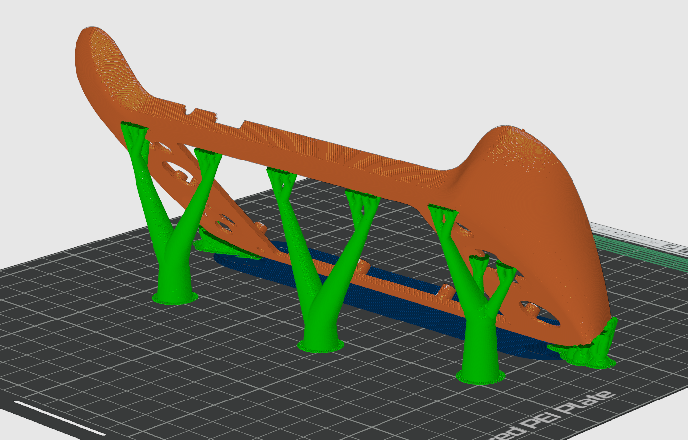

### PS2 Main Housing Bot (REF2001)
- Preferred Material: PLA
- Infill: 100% 

It's best to print this one a bit slower with thinner layers for better quality. Enabling auto tree supports should be sufficient. Can be printed vertically like shown below or tilted a little to remove all the supports for the screw posts.  

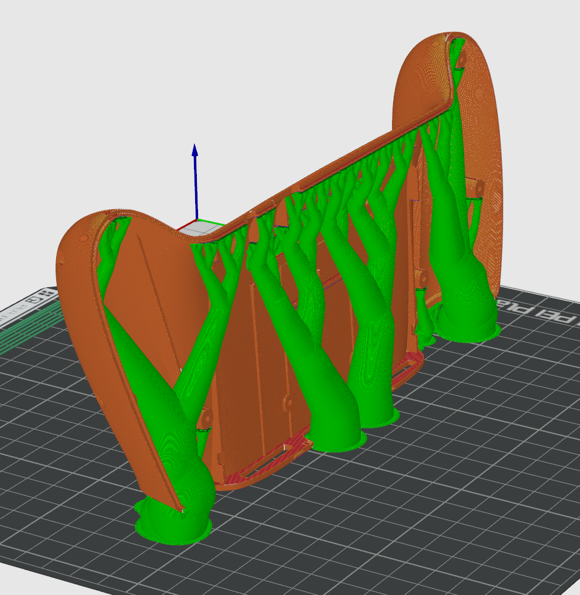

### Button Cover Left (REF2002) and Button Cover Right (REF2003)
- Preferred Material: PLA
- Infill: 50% 

The overall shape is just mirrored, so both are similar to print. Enabling auto tree supports should be sufficient.

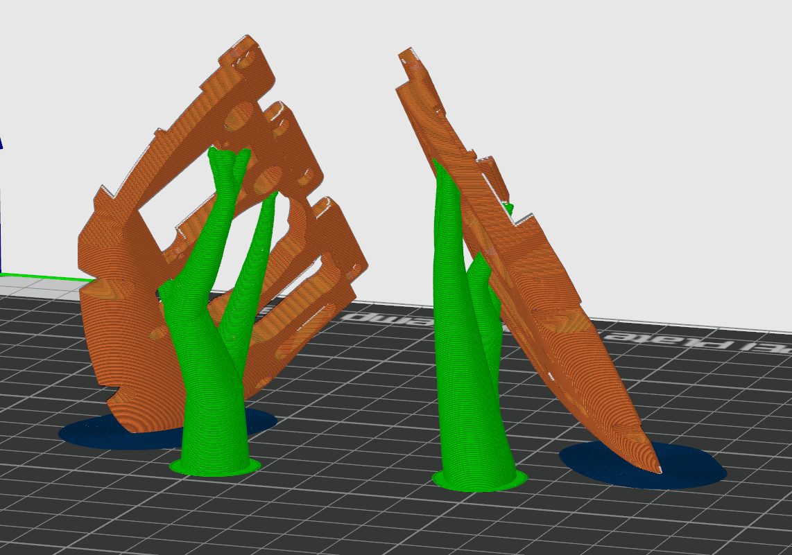

### Battery Compartment Left (REF2004) and Battery Compartment Right (REF2005)
- Preferred Material: PLA
- Infill: 50% 

The overall shape is just mirrored, so both are similar to print. Enabling auto tree supports should be sufficient.

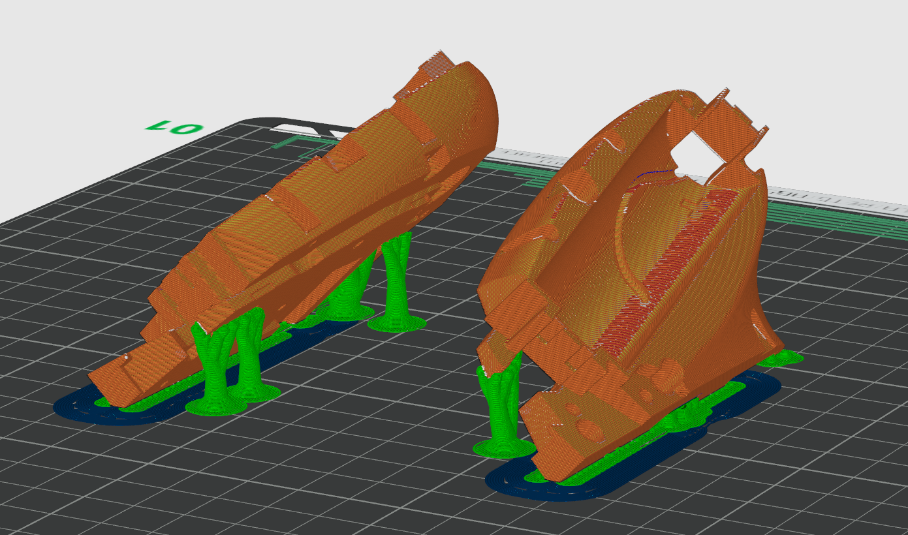

### Speaker Cover Left (REF2006) and Speaker Cover Right (REF2007)
- Preferred Material: TPU 95A
- Infill: 15%

Don't use a textured print bed for optimal fitment.

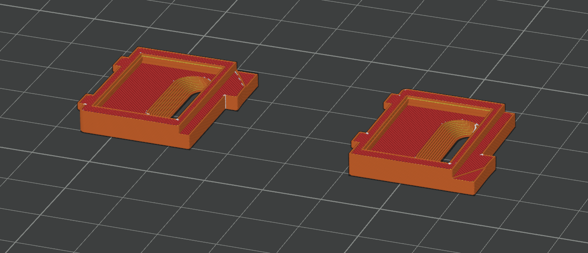

### Screen Lens Frame (REF2008)
- Preferred Material: PLA
- Infill: 50% 

Don't use a textured print bed for optimal fitment.

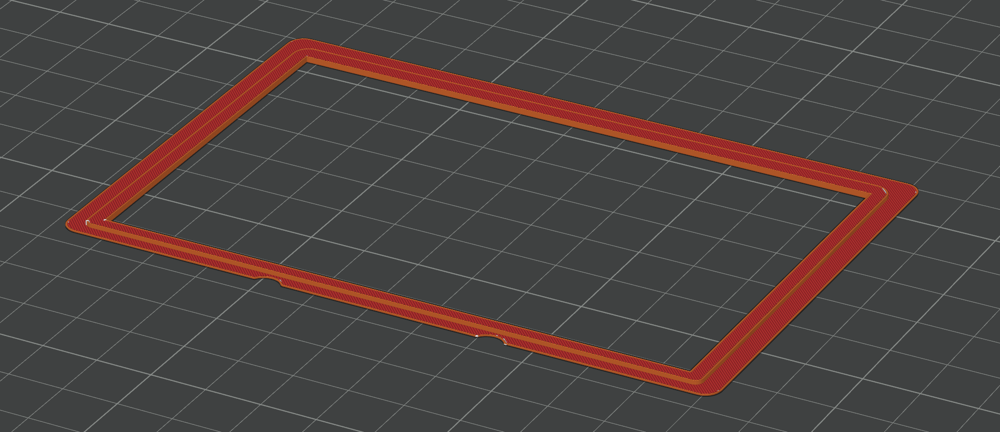

### Lower Display Mount (REF2009)
- Preferred Material: PLA
- Infill: 50% 

Don't use a textured print bed for optimal fitment.

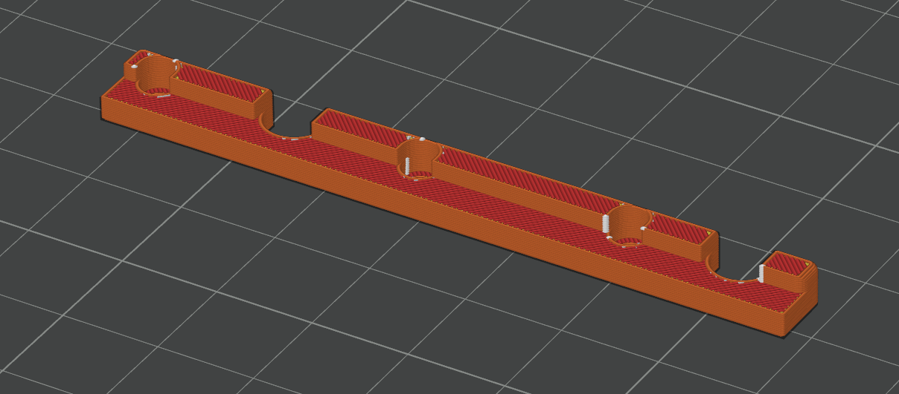

### R1-L1 Bar (REF2010)
- Preferred Material: PETG
- Infill: 100% 

Likes to warp, so a brim might be needed. For best fitment, it is recommended to use normal (no tree) supports with PLA interface layer to get a smooth and flat surface.

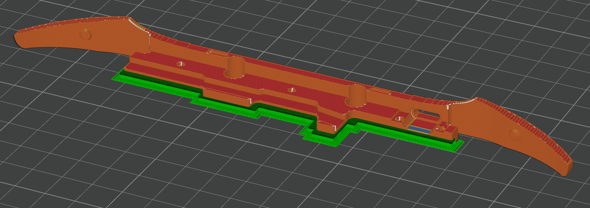

### L2 Button (REF2011) and R2 Button (REF2012)
- Preferred Material: PETG
- Infill: 100% 

Prints fine without supports. PLA is not recommended.

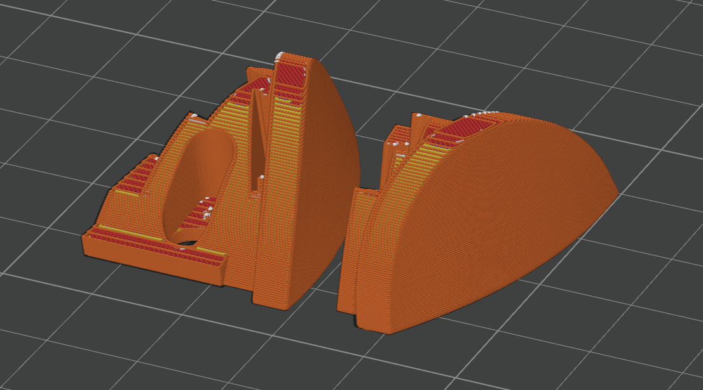

### MemoryCard Cover (REF2013)
- Preferred Material: PLA
- Infill: 50% 

Prints fine without supports. PETG could be considered, but the heatsink does not get warm enough to deform PLA.

### Backside Vent Cover (REF2014)
- Preferred Material: PLA
- Infill: 50%

Don't use a textured print bed for optimal fitment.

### Rumble Sleeve (REF2015)
- Preferred Material: TPU 95A
- Infill: 15%

Nothing special to note.

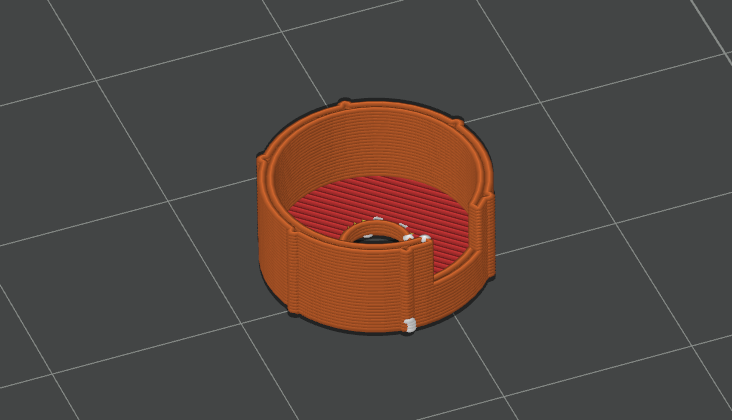

### Speaker Plug (REF2016)
- Preferred Material: TPU 95A
- Infill: 100%

Nothing special to note.

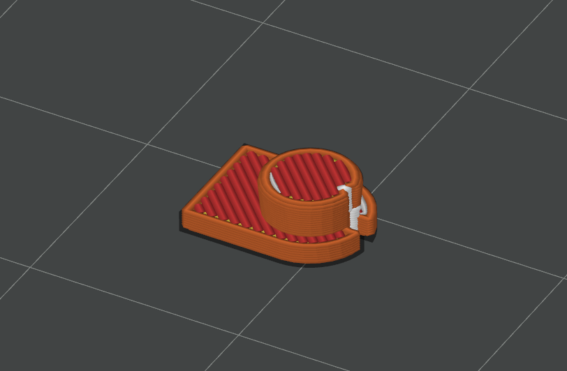

### uSD2PSX Frame (REF2017)
- Preferred Material: PLA
- Infill: 100%

Print with 0.1mm layer height.

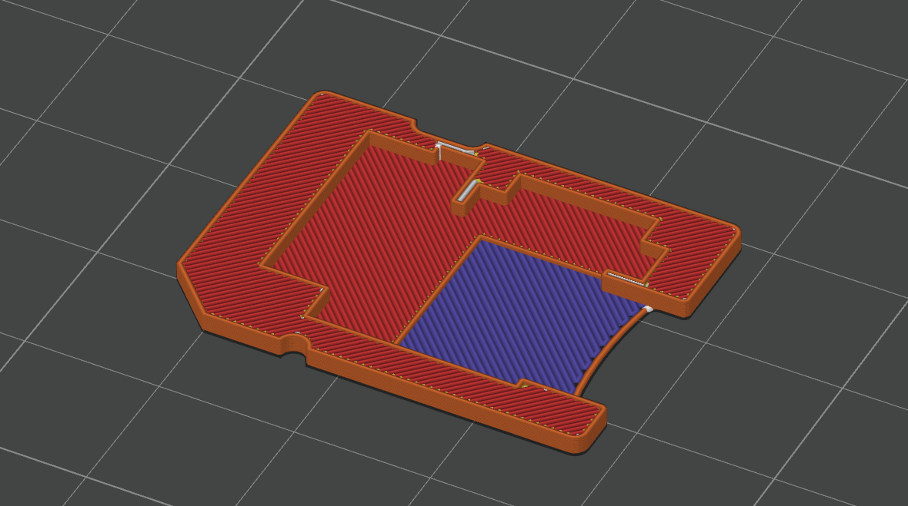

### uSD2PSX Stiffener (REF2018)
- Preferred Material: PLA
- Infill: 100%

Print with 0.1mm layer height.

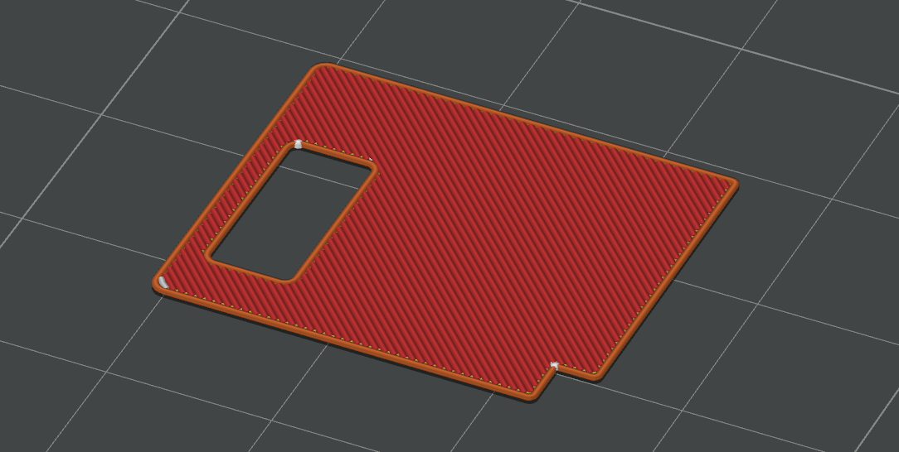

### Travel Case Top (REF2020)

- Preferred Material: PLA
- Infill: 50% 

Print with auto tree support:

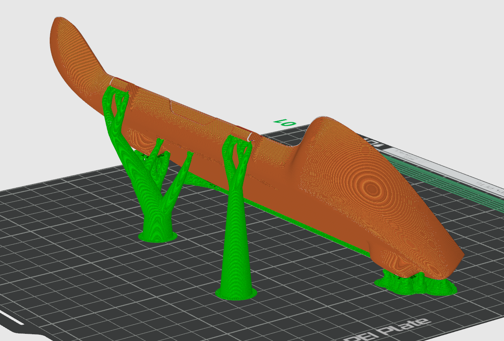

### Travel Case Bot (REF2021)

- Preferred Material: PLA
- Infill: 50% 

Print with auto tree support:

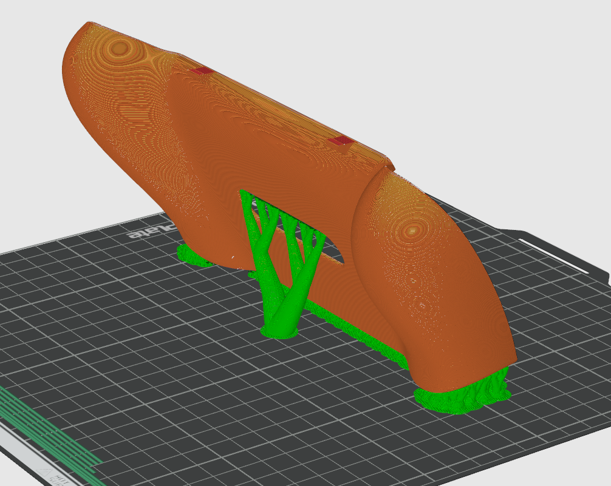

### Travel Latch Left & Right (REF2022 & REF2023)

- Preferred Material: PETG
- Infill: 100% 

No supports needed.

### Display Stand (REF2019)

- Preferred Material: PLA
- Infill: 15%

Prints fine without supports.

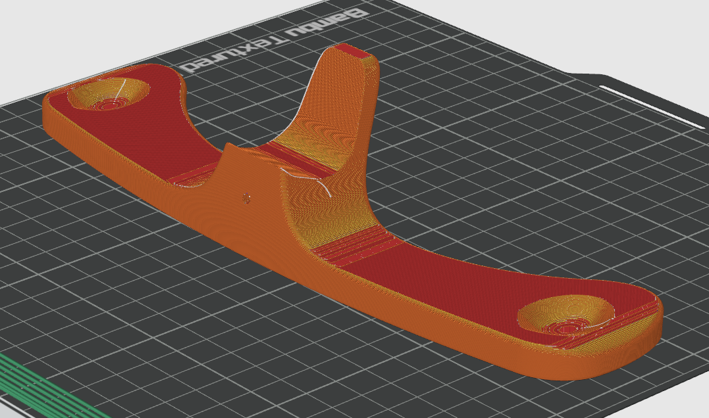

## CNC Parts and PCBs (JLC)
### Overview

### PS2 Heatsink (REF3000)
- Supplier: JLCCNC
- Material: Aluminium 6061
- Surface: Bead blasting; anodizing is absolutely not recommended for heat transfer reasons!
- Tolerance: ISO 2768 m
- Threads: TODO: create tapping drawing for the supplier; for now it's cheaper and faster to tap yourself; 

If you don't order the part pre-tapped, you will need to tap M1.6 threads in following locations:

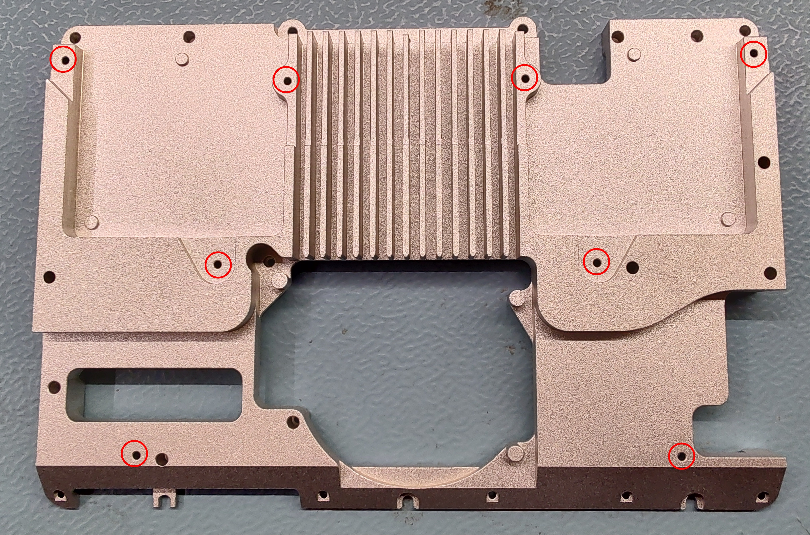

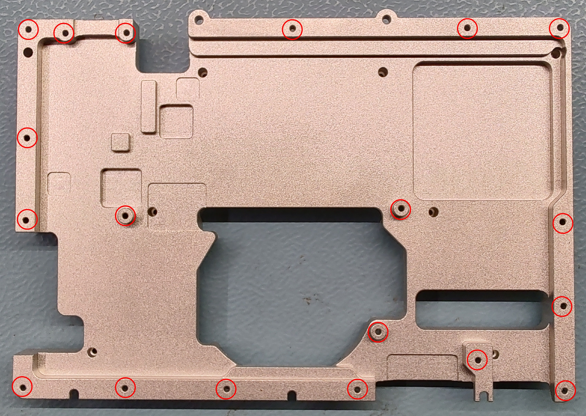

### PS2 Mainboard (REF4000)
- Supplier: JLCPCB
- Type: 6-Layer rigid
- Stackup: JLC06121H-3313; 1.2mm thickness
- Material: FR4 TG155
- Copper: Outer 1oz; Inner 0.5oz
- Plating: ENIG
- Via: VIPPO; Epoxy Filled and Capped
- [Gerber](https://github.com/tschicki/PS2-Portable/tree/main/Electronics/PS2_79004_Rev_0_4/Gerber)

### Gamepad Left (REF4001) and Gamepad Right (REF4002)
- Supplier: JLCPCB
- Type: 4-Layer rigid
- Stackup: JLC04081H-7628; 0.8mm thickness
- Material: FR4 TG135-140
- Copper: Outer 1oz; Inner 0.5oz
- Plating: HASL
- Via: tented or plugged
- [Gerber Left](https://github.com/tschicki/PS2-Portable/tree/main/Electronics/PS2_Gamepad_Left/Gamepad_Left_02/Gerber)
- [Gerber Right](https://github.com/tschicki/PS2-Portable/tree/main/Electronics/PS2_Gamepad_Right/Gamepad_Right_02/Gerber)

### Memory Card Flex (REF4003)
- Supplier: JLCPCB
- Type: 2-Layer flex
- Thickness: 0.11mm
- Stiffener: FR4 0.6mm
- Copper: 1/3oz
- Outline: Laser-cut
- [Gerber](https://github.com/tschicki/PS2-Portable/tree/main/Electronics/PS2_memcard_flex/Gerber)

### Gamepad Flex Left (REF4004) and Gamepad Flex Right (REF4005)
- Supplier: JLCPCB
- Type: 2-Layer flex
- Thickness: 0.11mm
- Stiffener: Polyimide 0.25mm
- Copper: 1/3oz
- Outline: Laser-cut 
- [Gerber Left](https://github.com/tschicki/PS2-Portable/tree/main/Electronics/PS2_Gamepad_Left/Flex_Left/Gerber)
- [Gerber Right](https://github.com/tschicki/PS2-Portable/tree/main/Electronics/PS2_Gamepad_Right/FLex_Right/Gerber)

### R1 R2 Flex (REF4006) and L1 L2 Flex (REF4007)
- Supplier: JLCPCB
- Type: 2-Layer flex
- Thickness: 0.11mm
- Stiffener: Polyimide 0.25mm
- Copper: 1/3oz
- Outline: Laser-cut
- Gold Fingers -> YES (0.3mm total thickness flex + stiffener)
- [Gerber L1 L2](https://github.com/tschicki/PS2-Portable/tree/main/Electronics/PS2_Gamepad_Left/Flex_L1_L2/Gerber)
- [Gerber R1 R2](https://github.com/tschicki/PS2-Portable/tree/main/Electronics/PS2_Gamepad_Right/Flex_R1_R2/Gerber)

### uSD2PSX Flex (REF4008)
- Supplier: JLCPCB
- Type: 2-Layer flex
- Thickness: 0.11mm
- Stiffener: None
- Copper: 1/3oz
- Outline: Laser-cut 
- [Gerber](https://github.com/tschicki/PS2-Portable/tree/main/Electronics/uSD2PSX/Gerber)

## Tools

### Reballing Stencils
The custom reballing stencils are supplied by JLCPCB. They are 90x90mm and fit the common rose-gold reballing fixtures. The cutouts are optimized for 0.55mm solder balls. 
You can find the Gerbers [here](https://github.com/tschicki/PS2-Portable/tree/main/Electronics/PS2_Reballing_Stencils_Eval/Gerber). The files contain a panel outline too, so the panel can either have a 190x190mm custom size (cheaper shipping) or JLCs default 380x280mm stencil size.  
For ordering add the following comments:

- Please do not change the stencil aperture
- Stencil thickness: 0.2mm
- Engraving: Text and position, see file "engrave.gbr"

### Tool for M1.6 Brass Inserts
A tool for M1.6 heat set inserts is very difficult to find, especially as a tip for soldering irons. I personally use the M2 adaper for Ersa soldering irons available from [CNCKitchen](https://cnckitchen.store/de/collections/soldering-tips-and-sets). To have the correct diameter and about 3mm length, I modified it using a drill, file and sandpaper.

### Heatsink Tapping Tool
Proper handles for M1.6 taps are just as uncommon as the tools for M1.6 brass inserts. The [Output](https://github.com/tschicki/PS2-Portable/tree/main/Solidworks/Output) folder contains a 3D printed tool that could help you.

### Sanding Tool
In case you want to fill and paint the outer housing I made a tool for sanding the action button & DPAD cavities. It has the same curvature and you can just adhere a piece of sandpaper to it using double-sided tape. You can also find it in the [Output](https://github.com/tschicki/PS2-Portable/tree/main/Solidworks/Output) folder.

