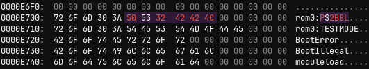
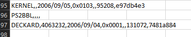
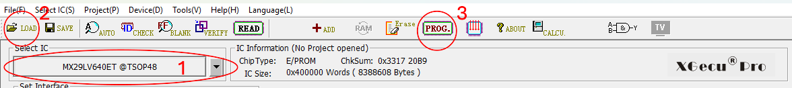
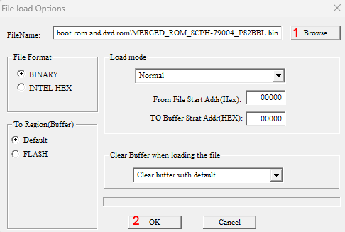
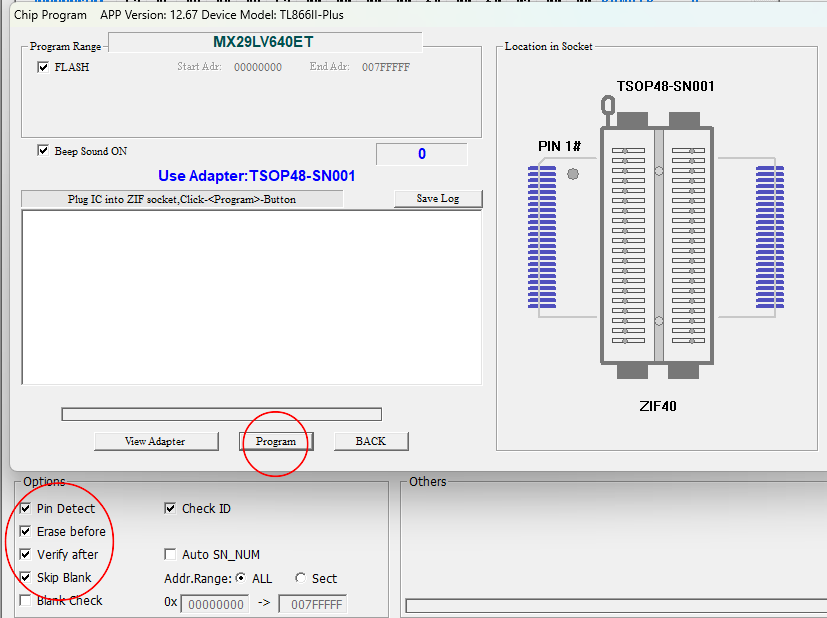

# Part 2: Boot ROM Preparation
This part of the assembly documentation will describe how to prepare the MX29LV640ET NOR flash for the PS2 AIO Maonboard Assembly.
The chip must be flashed with a functional BIOS, otherwise the console will never boot.

For the Boot ROM you have two options:
1. Flash a stock SCPH-7900x BIOS of your console's region
2. Modify the stock SCPH-7900x BIOS of your console's region to auto-boot into PS2BBL and flash that

Since the SD2PSX offers a very easy and attractive way to softmod the PS2, a boot rom modification is not strictly required. However, your choice here will mandate how you have to set up the BOOT Memory Card of your SD2PSX. If you go for option 1, you need to set up the Memory Card just like you would set it up for a stock console. For option 2 on the other hand, you will only need to provide the PS2BBL config file and an .ELF of the hombrew launcher of your choice (NHDDL recommended) on the BOOT Memory Card. The fastest and easiest way for sure is option 1: to flash a stock boot rom and DVD rom onto the 64Mbit NOR flash. For advanced users, option 2 is still listed.

## Option 1: Stock Boot ROM
1. Obtain a SCPH-7900x BIOS of your donor console's region. Make sure to also dump/obtain the matching DVD ROM. 
    - (preferred) You can dump both from the donor console using PS2Ident. 
    - Otherwise you can find a matching v2.20 Boot ROM and v3.11 DVD ROM of the donor's region online.
2. Ensure in PCSX2 that the Boot ROM is functional. 
3. Then you will need to merge Boot and DVD ROM together. 
    - To do that, use the python script 'merge_boot_upper_dvd_lower_with_padding.py' in the *Boot ROM* directory
    - Make sure to rename the Boot ROM to `BOOT_ROM.bin` and the DVD ROM to `DVD_ROM.bin` before running the script, and place them in the script’s directory. 
    - To launch the script, open a terminal in the script’s directory and type `python merge_boot_upper_dvd_lower_with_padding.py`. You need to have Python 3.12+ installed.
4. A file called “MERGED_ROM.bin” will appear in the explorer. This is the ROM you need to program onto the NOR flash. Refer to *Flash Programming* for that.
5. Verify in the file properties that the binary has exactly 8MB, otherwise something went wrong with merging.

## Option 2: Modified Boot ROM
What you will need in addition to Option 1:
- an .ELF of [PS2BBL](https://github.com/israpps/PlayStation2-Basic-BootLoader), preferrably the one with the smallest filesize (i.e. no fancy features like MMCE). You can also use the custom build of PS2BBL I put in the [Boot ROM directory](https://github.com/tschicki/PS2-Portable/tree/main/Boot%20ROM), it launches OSDSYS instead of emergency mode when no memory card is plugged.
- [ROMMAN](https://github.com/israpps/romman) for building the custom Boot ROM binary

Obtain a stock SCPH-7900x BIOS of your console's region. Make sure to also dump/obtain the matching DVD ROM. The easiest is to create a folder and copy both the Boot ROM binary and ROMMAN there.

### The following applies if you have ROMMAN compiled for Windows:
1. Extract the Boot ROM using ROMMAN: 
    > romman-windows.exe -x [*Path to Boot ROM filename*].bin
2. Modify the EELOAD module extracted by ROMMAN, you find it in the **folder** [*Boot ROM filename*].bin
    - Open the EELOAD file in a HEX editor (e.g. [ImHex](https://https://imhex.werwolv.net/)) and look for *rom0:OSDSYS* and *rom0:TESTMODE*; replace **OSDSYS** with **PS2BBL**
    - This modification will force the console to boot into PS2BBL instead of OSDSYS  
      
3. In the ROM config ([*Boot ROM filename*].csv) add the following line before the DECKARD module: `PS2BBL,,,,`
    - This will tell ROMMAN to insert PS2BBL here  
     
4. Delete the .ELF file extension of the obtained PS2BBL ELF (should just be a file, no .ELF file) and copy it to all the other modules in the **folder** [*Boot ROM filename*].bin created by ROMMAN
5. Build the new ROM using ROMMAN: 
    > romman-windows.exe -g [Boot ROM filename].csv ext_[Boot ROM filename].bin/ [name of generated binary].bin
6. Test the newly built Boot ROM in PCSX2 -> you should be greeted by a PS2BBL logo
7. Lastly, merge the custom Boot ROM and the DVD ROM the same way as described for Option 1.

## Last Step: Flash Programming
For programming I use a TL-866II PLUS with TSOP-48 adapter and the software “Xgpro”. 
1. Select the correct flash chip from the top left, for the stock BOM it is “MX29LV640ET @TSOP48”.  

    
2. Open the generated binary file using “load file”, I never had to change the default settings here.  

    
3. Then use the button “PROG.” to program the flash with the binary, this takes some time. Make sure the verify was successful!  

     
4. Afterwards you can remove the flash from the adapter, it’s now programmed with the BIOS and ready to use for soldering.

    

     
    