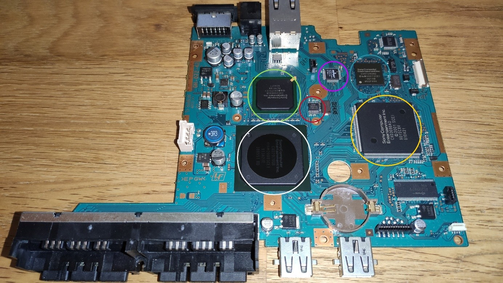
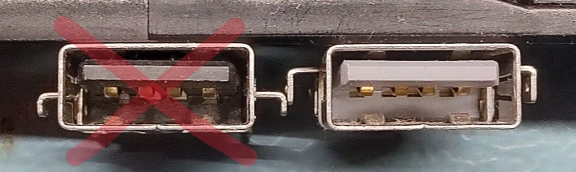
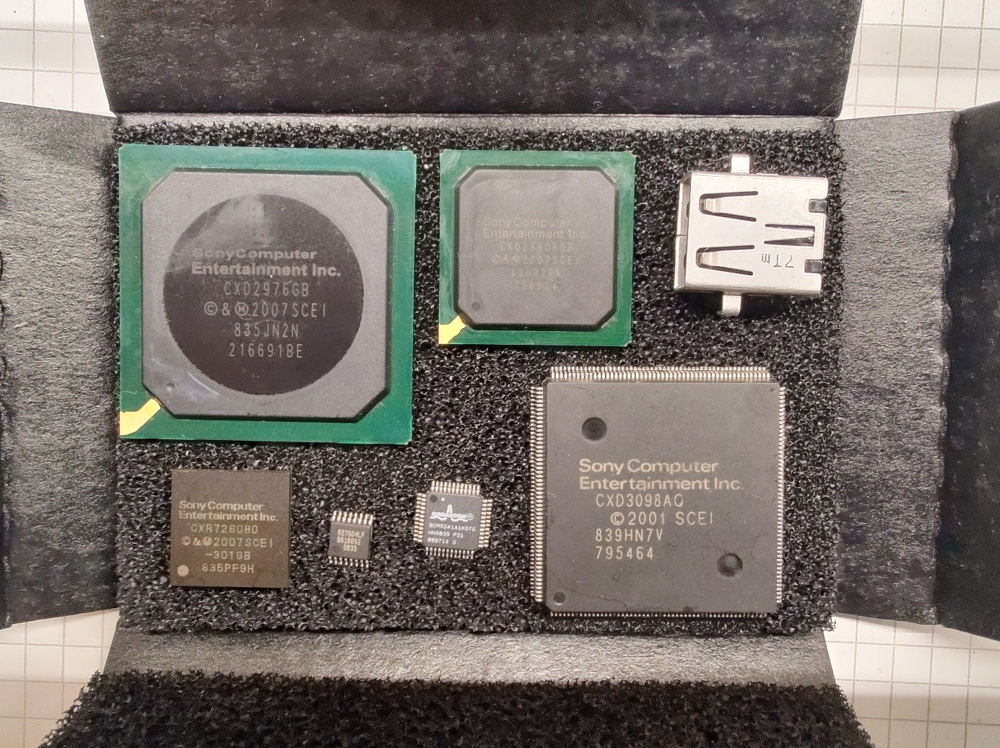
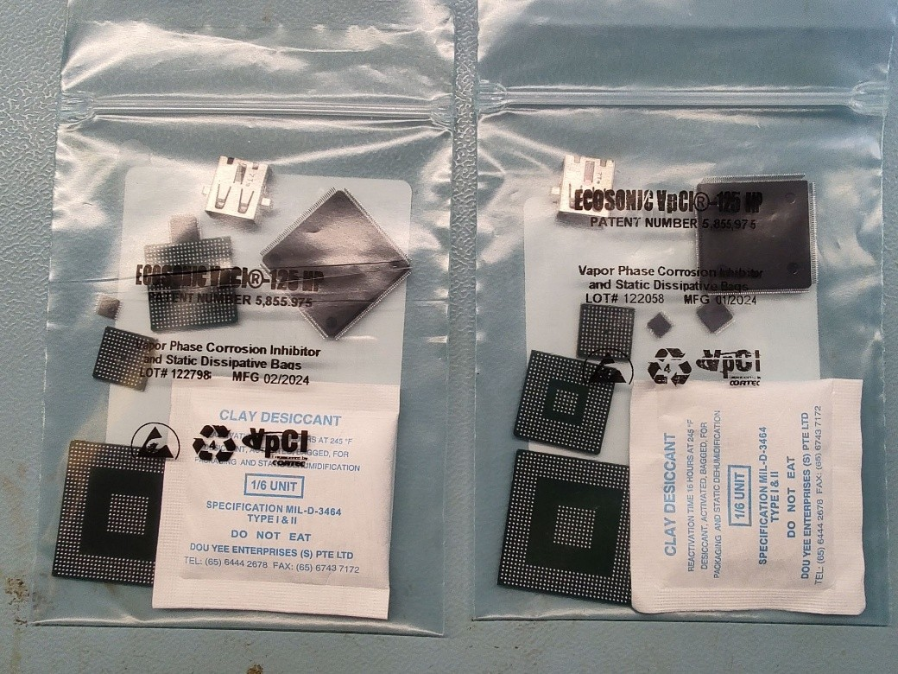

# Part 3: PS2 Components Preparation
This part of the assembly documentation will describe how to salvage the required PS2 components for the portable PS2.

General tips for the procedure:
- This process will generate lots of toxic solder fumes, so a proper fume extractor and sufficient ventilation are highly recommended!
- While I always touch flux and isopropanol with bare hands, you should know better than me and wear protective gloves!
- Testing a SCPH-9000x mainboard with its internal power supply in a non- or partially assembled housing can expose you to mains voltage! Be very careful when handling the integrated power supply and absolutely avoid touching it as much as possible! Remember: those primary side capacitors can also shock you, even when the unit is unplugged!
- You can and will burn yourself during the procedure! Hot air is hot and soldering irons are hot (doh…)

I’m not a professional IC reballer and I’ve only done a handful of chips so far, so please take the below steps and tools with a grain of salt. If you own a BGA rework station you probably know better than me and should only read the below procedure for reference. If you have no reballing experience, it’s best to try the procedure on a broken mainboard first, as your first attempt is very likely to fail.

Following components of a PS2 **SCPH-7900x or SCPH-9000x** mainboard are to be salvaged:

> White: EE  
> Green: GS  
> Red: Clock PLL  
> Pink: Ethernet PHY  
> Blue: Mechacon  
> Yellow: DSP

Additionally, a USB A port of a PS2 **SCPH-7000x to SCPH-7900x** is required. **DO NOT** use the port of a SCPH-9000x! It is physically different and while it fits the custom mainboard, due to its height distribution it will not fit below the screen!

> On the right is a SCPH-7900x USB port -> WILL FIT  
> On the left is a SCPH-9000x USB port -> WILL NOT FIT!

## Recommended Tools:
The below tools act mainly as a suggestion, you can of course use everything that gets the job done.

-	Temperature controlled (reflow) oven
-	Hot air station (e.g. ATTEN ST-862D), use the biggest possible nozzle
-	IR preheater (e.g. AOYUE 853A)
-	Soldering iron with a high heat capacity tip (for solder wick)
-	Thermometer, ideally with 2 thermocouples rated min. 300°C
-	Vacuum pickup tool (not absolutely needed, but very handy)
-	Reballing fixture for 90x90mm stencils
-	Custom EE, GS and Mechacon stencils, see hardware files
-	A microscope, up to 45x magnification
-	All the usual stuff: tweezers, scalpel, Kapton tape, …

## Recommended Materials:
-	0.55mm leaded solder balls
-	Solder, preferably leaded
-	Solder wick
-	Isopropanol 99%
-	Flux, lots of flux. The tacky stuff. Stirri ASM-TF works well.
-	A SCPH-7900x or SCPH-9000x mainboard, obviously

## Procedure

### Before Starting:
-	Make sure you have a **SCPH-7900x or SCPH-9000x** mainboard revision!
-	**IMPORTANT:** Before starting, ensure that the mainboard is fully functional

### Preparation Baking:
1.	Bake the mainboard at 110°C for about 5 hours to remove any moisture from components and PCB.   
    This is important to reduce the likelihood of delamination or popcorning of the EE and GS substrates during reballing and reflowing.
2.	After baking, give the mainboard a quick test to ensure it still works.
3.	In case the chip removal doesn’t happen right after baking, seal the mainboard in an ESD bag, preferably together with desiccant.

### Component Removal:
1.	Place the mainboard on the preheater, preferably mount a thermocouple on the bottom layer for monitoring.
2.	Place another thermocouple on the top layer, if possible try to stick it below or next to the EE, as this is the hardest chip to remove.
3.	Securing the thermocouples with Kapton tape works quite well
4.	Using the preheater, heat the bottom thermocouple to around 220°C, give it a couple of seconds for the heat to transfer through the board.
5.	Heat up the EE using hot air, try to keep the top thermocouple below 300°C to stress the chips as little as possible. A good starting point for the hot air station would be 90% airflow at 360°C.  
    Focus on the EE first, heat it in a circular motion and carefully poke it with the tweezers until you can push it.
6.	Using a vacuum pickup tool (or tweezers if you’re skilled) remove the EE from the board and place it on something with low thermal conductivity and low surface area to reduce the thermal shock. I like to use an empty electrical tape roll for that.
7.	Continue heating the GS the same way, as the board is already on temperature it will be much easier to remove than the EE. Remove it the same way as the EE and put it aside.
8.	Continue with the remaining chips, I recommend the following sequence: Mechacon, Clock PLL, Ethernet PHY and DSP last.
9.	Again, avoid thermal shocks for all chips.
10.	For EE, GS and Mechacon: apply a good amount of flux and leaded solder to the solder balls and clean them up using solder wick. Use the lowest possible soldering iron temperature (between 250 and 300°C), a tip with high thermal mass makes this much easier.  
    And very important: do not apply pressure when wiping the chips with the solder wick!
11.	Make sure that the pads are absolutely clean from solder, any bump or leftover piece will increase the risk of failure later!
12.	Also clean up the remaining QFP chips with leaded solder, flux and wick
13.	Clean all chips thoroughly with 99% isopropanol.

### Reballing:

> - This applies only to EE, GS and Mechacon, the steps are the same for all three  
> - A generic stencil may be used (assuming all unused holes are masked), but I highly recommend the custom designed stencils for all three chips.  
> - It is very important to keep all the equipment and tools as clean as possible! Thoroughly clean the BGA fixture, stencils, tweezers and everything that touches the solder balls using 99% isopropanol. 
> - Do this after every chip and as often as possible! The solder balls stick to everything that’s even slightly contaminated, which will make this much more difficult!  
> - NEVER EVER put contaminated solder balls back into the jar of fresh ones!

1.	Place the chip and respective stencil in the fixture, align them.
2.	Drop a solder ball in each corner and adjust the height of the stencil, so the balls are held in place, but do not protrude too much from the stencil (I’d say approx. 1/3 of the ball’s height can protrude)
    - When the stencil is too high, the solder balls may start moving below the stencil and contaminate everything with flux later
    - When the stencil is too low, the solder balls might jump out of their holes again and contaminate everything with flux.
    - Both results most likely end up with solder balls sticking to the stencil instead of the chip, or moving during stencil removal -> leads to a lot of manual rework with tweezers!
3.	When the height was set, lift the stencil and apply a thin layer of tacky flux over the whole bottom surface of the chip, make sure you don’t miss any pads! Easiest to do with your finger
    - Make sure the chip is absolutely clean before applying flux! No residue, no dust, no hairs!
4.	Place the chip in the fixture again and close it
5.	Drop in a bunch of solder balls and ensure that all holes are filled with exactly one ball
6.	Give the lid a tiny wiggle in both X and Y directions and carefully lift it up
7.	If you’re skilled and/or lucky, all solder balls are in place and perfectly aligned
8.	If not -> either arrange the bad solder balls manually with tweezers or clean everything off and restart
9.	Place the chip on the preheater, I usually use a leftover stencil as a tray for it to sit on
    - I usually pick the chip up using tweezers in one of the corners (all 3 have a missing pad in every corner)
    - Do not bump the chip anymore! The slightest bump might push the solder balls out of alignment!
    - I usually set my preheater to 320°C for reballing
    - Be careful with heating when using a stencil as a tray, it warps
10.	Heat up the chip to about 150-200°C with the preheater and slowly hover over all solder balls using hot air
    - BE VERY CAREFUL WITH THE AIRFLOW! Too high and you will blow the solder balls out of position! Worst case they merge, which is a real pain to fix!
    - Recommended hot air setting (applies to ST-862D): 320°C, 10% airflow
11.	Carefully observe all solder balls, they turn shiny and move slightly when they are melting. When you think all are molten, keep applying the heat for a couple of seconds to ensure all solder balls connect to their pad. Lastly, carefully apply some drops of flux spread over the chip to reach all solder balls. This prevents them from turning dull and wrinkled, and increases the chance of them not falling off during cleaning.
12.	When everything is done, carefully remove the chip from the preheater and place it aside to allow the solder balls to solidify. Again, place it on something with low thermal conductivity to allow the chip to cool down slowly.
13.	When the chip is at room temperature, clean it CAREFULLY using 99% isopropanol. No force at all to not rip off any of the solder balls! A fine ESD safe brush works well. Make sure to remove every little piece of dust to increase the chance of a working mainboard!
14.	When everything is done, bake all chips again for an hour at 110°C

### Obtaining the USB A Port:
1.	As mentioned, make sure you get a mainboard with the right type of USB A port
    - In general, I have seen them on all slim models prior to the SCPH-9000x
    - Make sure you have the right port, compare it to the picture above! The position of the mounting pins when looking into the port are the best way to spot which port you have!
2.	Remove the port, try to keep it in one piece and don’t melt the plastics.
3.	Remove all the solder on the pins using solder wick and clean the port using 99% isopropanol

### Inspection and Packaging: 
1.	Do a final inspection under a microscope. 
    - Check that all solder balls are in place and have the same size. You can also carefully wipe the underside of the chip on some paper; any protruding solder balls will leave very visible lines. This is not very ESD safe, though.
    - The solder balls shall be round and shiny, not dull and wrinkled
    - No flux residue
    - If you spot any soldering defects on the BGA solder balls, you should probably start with a new console. Reflowing the same chips again will reduce the chance of success.
2.	Make sure to remove every piece of dust and hair under the microscope, especially for the BGAs.
3.	Inspect the DSP for bent, missing or shorted pins
    - Slightly bent pins can easily be fixed, for badly bent pins there is a high chance of breaking them while fixing. Lots of DSP pins are unconnected, so in case you do break a pin it might still be salvageable -> check the schematic in that case!
    - Be very careful when handling the DSP in general, the pins are easy to bend
4.	Package all components in an ESD safe bag, together with some desiccant 

## Result:
When everything is done, you should end up with the following components:

 
Package them in ESD & humidity safe packaging: 

# End
You now have all the PS2 components you need for assembling the PS2 AIO Mainboard!
