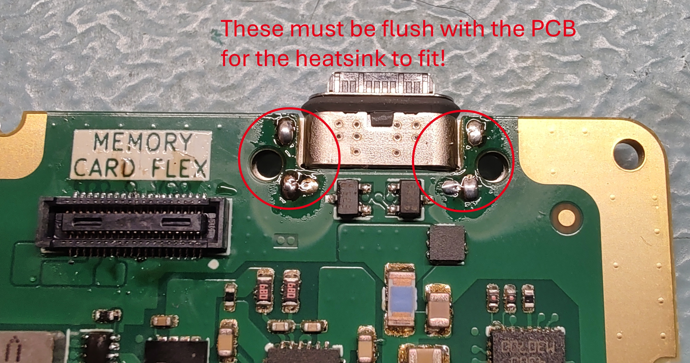
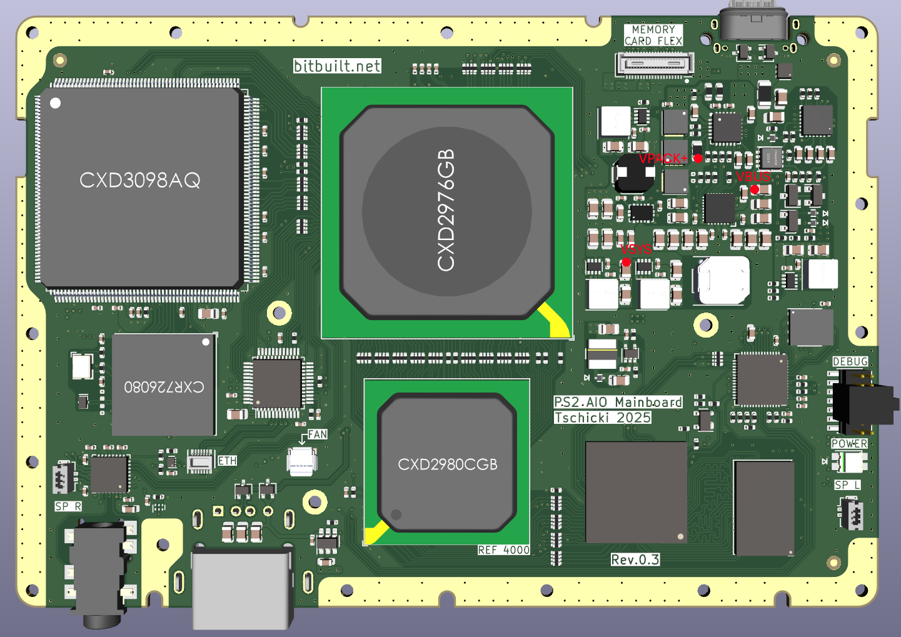
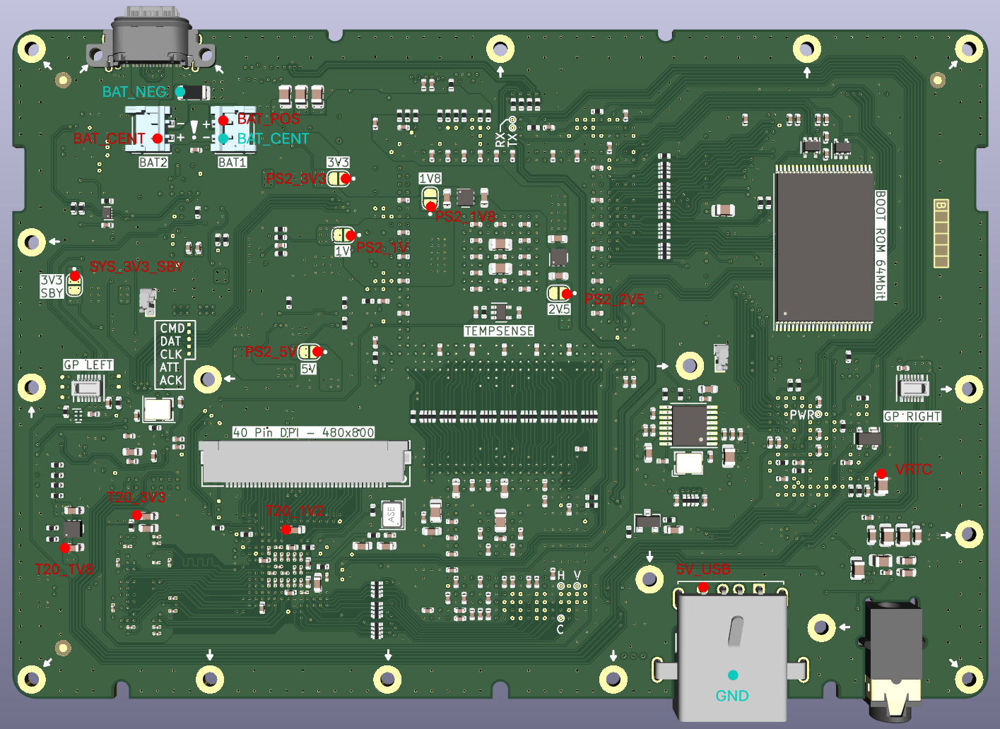

# Part 4: Custom Mainboard Assembly
This part of the assembly documentation will describe soldering the *PS2 AIO Mainboard*.
The mainboard assembly and bringup is very challenging, plan for at least 10 hours if everything goes smoothly. There are a couple of options to assemble the mainboard, you could for example get the maonboard mostly populated by a supplier like JLCPCB or PCBWAY. Another approach would be to solder everything by hand using hot air, it's slower and more error-prone, but doable. The approach described here will require a reflow oven, it's from my experience the most reproducible way to populate the mainboard.

General tips for the procedure:
- This process will generate lots of toxic solder fumes, so a proper fume extractor and sufficient ventilation are highly recommended!
- While I always touch flux and isopropanol with bare hands, you should know better than me and wear protective gloves!
- Only touch the mainboard on the edges, try to not tough the ENIG plating with your bare fingers
- You can and will burn yourself during the procedure! Hot air is hot and soldering irons are hot (doh…)

## Recommended Tools:
The below tools act mainly as a suggestion, you can of course yuse everything that gets the job done.
-	Temperature controlled (reflow) oven
-	Pasting fixture
-	Soldering iron
-	Vacuum pickup tool
-	A microscope, up to 45x magnification
-	A good pair of precision tweezers
-	Multimeter
## Recommended Materials:
-	Top & bottom solder stencil for the mainboard; you should probably order it together with the mainboard
-	Solder paste, class 4 or 5; can be lead-free or leaded
-	Solder (lead-free or leaded)
-	Copper tape
-	Flux

## Procedure
The procedure is split into three main parts, I recommend you to take a break between each of them. First we will populate the bottom layer (~3h), then the top layer (~3h) and lastly measure the power rail impedances to GND (~1h), to get a good idea of whether the PS2 AIO mainboard would be functional.

### Bottom layer assembly
Before starting, carefully inspect the PCB under a microscope to spot possible defects early. Then apply solder paste to the bottom layer. The default stencil has no cutouts for the NOR flash, USB-C connector and clock PLL, these are best hand-soldered after doing the top layer. If your stencil does have these cutouts, consider to mask them.

Populate the bottom layer SMD components using the convenient HTML BOM file, except for the mentioned parts. The USB A socket will be done last, together the other components listed above.

> Take special care to orient all ICs and polarized components correctly. 
> Some parts might need to be checked under the microscope to spot the pin 1 indicator. 
> In case of doubt, consult the part’s datasheet and cross-check with the PCB layout. When the parts are placed, place the board in the reflow oven for the first reflow.

Place the mainboard in the reflow oven and inspect all connections under the microscope afterwards. Then apply copper tape over the LCD connector, battery connectors and gamepad connectors. This is to keep them from falling off, or melting during the top layer reflow. Alternatively, you could adhere these components to the board using specialized glue for SMD reflow. With this you are done with the bottom layer

### Top layer assembly
For pasting the top layer it is highly recommended to have a pasting fixture, as the underside of the mainboard is not flat anymore. On the default top layer stencil, all BGA ICs have no cutouts for the solder paste. 
Make sure to not get any solder paste onto the BGA pads! Proceed by populating all components except for the BGAs. Again, be careful with pin 1 indicators! 
The last components to be placed are the BGAs, here we need to take some more care:

- First clean all BGA pads using a Q-Tip slightly moistened in 99% isopropanol. 
- Verify under the microscope that no dust or hairs are on the BGA pads or the underside of the BGAs and then continue by spreading a thin layer of flux over **ALL** BGA pads. 
- Place the EE, GS, Mechacon, T20 and SDRAM in their intended position -> pin 1 indicator! Align them as good as possible using the silkscreen markings.

In case you have some doubts about orientations, you can refer to the reference pictures of the mainboard. This also applies to the debug header, don't populate it the wrong way around!
Once all parts on the top layer are placed, do a last thorough check under the microscope and place the mainboard in the reflow oven. As the underside is not flat anymore, it’s best to place the mainboard on some spacers inside the reflow oven, I usually use 6x M6 nuts. Do a reflow using a lead-free profile (T20 and SDRAM have lead-free solder balls) and let the mainboard cool down without thermal shocks.
Remove the copper tape and solder the remaining components by hand – Clock PLL, NOR flash, USB-C, USB-A. It’s very important that the NOR flash was already programmed with a PS2 BIOS – please refer to [Part 2](https://github.com/tschicki/PS2-Portable/blob/main/Documentation/Part%202_Boot%20ROM%20Preparation.md) for that. 
When soldering the USB-A socket, be very careful that it’s the correct style of connector and make sure to assembly it on the correct side (bottom!). After soldering the USB-C connector, there will most likely be some excess solder at the 6 mounting pads on the top layer. It's important that you remove all excess and make all 6 solder joints flush with the PCB, otherwise the heatsink will not sit flush here!

At this point, all required components according to the mainboard’s BOM should be installed. Now go over the whole mainboard and inspect every solder connection. It’s very likely that some pins are shorted, while other pins might have no connection. Fix all faults you can find before proceeding, for the DSP it might help to gently push on every pin to see whether it is properly soldered to the board. Cleaning everything properly will help you spot issues!

> Be 100% sure that all solder connections are good before starting with the board bringup!

### Impedances
Before powering on the mainboard for the first time, check the resistances of all points in the table below. Make sure that no jumper on the bottom layer was closed yet.
Note: The resistances vary from console to console, so your measurements don’t need to exactly match the ones shown in the table. Just make sure you are within the same ballpark; the sample size is just too small currently. 
**It would be great if you could document the measured values for future reference.**

| Positive Probe | Negative Probe | Impedance |
|----------------|----------------|-----------|
|VBUS | GND | >50kΩ |
|VSYS | GND | >1MΩ |
|VPACK+ | GND | >1MΩ |
|BAT_POS | GND | >1MΩ |
|BAT_POS | BAT_CENT | >1MΩ |
|BAT_CENT | BAT_NEG | >1MΩ |
|VRTC | GND | >100kΩ |
|T20_1V2 | GND | ~500kΩ |
|T20_1V8 | GND | ~80kΩ |
|T20_3V3 | GND | ~50kΩ |
|PS2_3V3 | GND | ~3.4kΩ |
|PS2_2V5 | GND | ~40kΩ |
|PS2_1V8 | GND | ~3.7kΩ |
|PS2_1V | GND | ~30Ω |
|PS2_5V | GND | >1MΩ |
|5V_USB | GND | >1MΩ |
|SYS_3V3_SBY | GND | >9kΩ |

*Mainboard front view with measurement points*

*Mainboard backside view with measurement points*

### Final Touches
It's a good idea to retouch all SMD connectors with leaded or lead-free solder if you used low-temperature lead-free solder paste (the kind that contains Bismuth) for the assembly, as that type of solder is soft and not very robust.  
Especially the left and right gamepad connectors can be a bit fragile and it is recommended to add a small drop of epoxy to either side of the connectors in any case. Just try to not get it on the pins annd let it cure properly before proceeding.

## End
With all these steps done successfully, you have an assembled PS2 AIO mainboard in your hands. If the measurements look OK, you can continue with the next part.