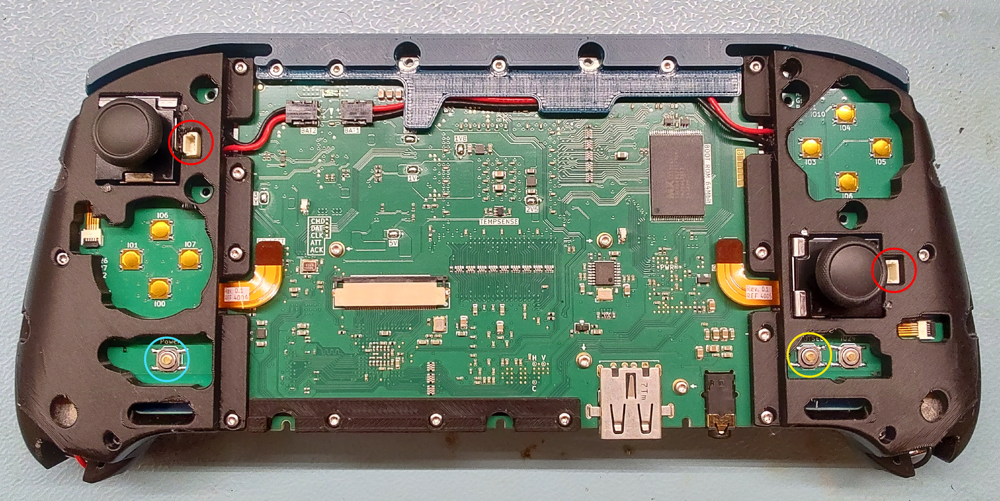
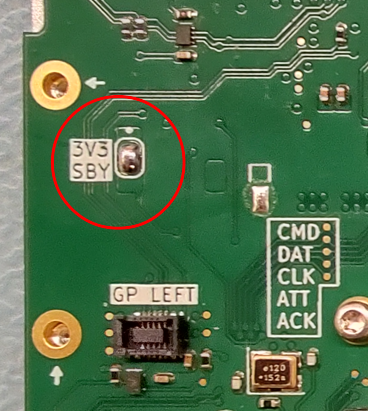
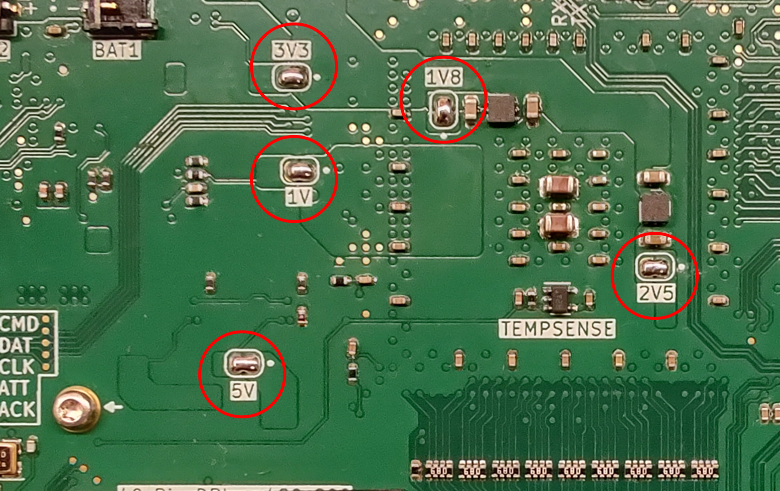
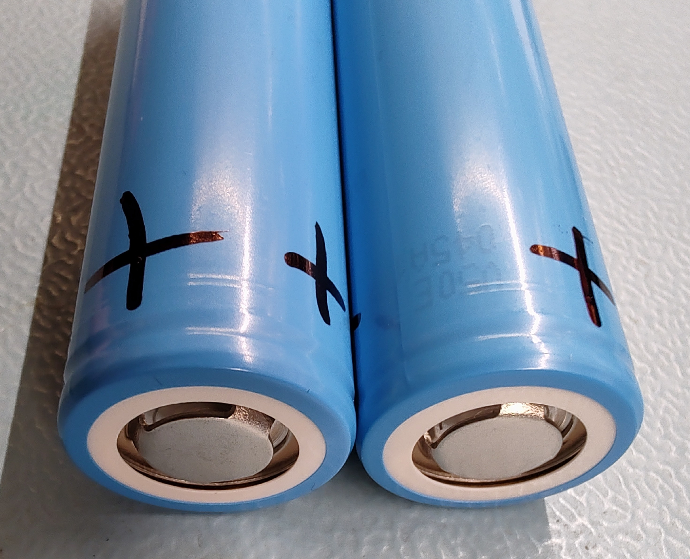
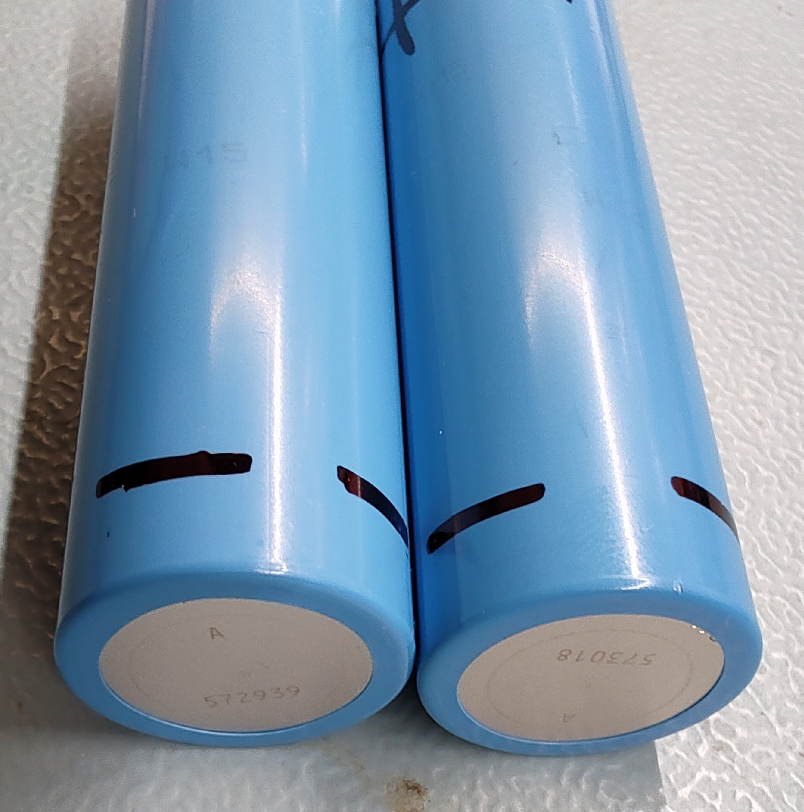

# Part 6: PS2 AIO Mainboard Bringup 
This part of the assembly documentation will describe the bringup process of the custom PS2 AIO Mainboard. In order to compile the needed SysCon and gamepad firmware, you will need to set up the RP2040 SDK in VSCode - you will find more detailed steps in [Part 10](https://github.com/tschicki/PS2-Portable/blob/main/Documentation/Part%2010_Development%20and%20Debugging.md).

## Recommended Tools:
- Soldering iron
- Multimeter
- Pico Debug Probe OR PS2 debugger (PS2 debugger is an accessory, see [Part 8](https://github.com/tschicki/PS2-Portable/blob/main/Documentation/Part%208_Accessories%20Assembly.md))
- USB-C power meter (voltage/current/wattage)
- USB-C PD power supply (20V >15W)
- Screwdriver kit (T5)

## Recommended Materials:
- Solder (lead-free or leaded)
- USB-C cable
 
## Procedure
### Assembly for Testing
For more details about the final assembly, refer to the assembly procedure of the whole system ([Part 7](https://github.com/tschicki/PS2-Portable/blob/main/Documentation/Part%207_Final%20Assembly.md)). Below steps are only a sum-up of what is needed to temporarily assemble for testing and programming the PS2 AIO Mainboard.
- Temporarily mount the mainboard in the heatsink with a couple of screws. No thermal pad needed for now.
- Mount the Bumper bar and bottom display frame temporarily to hold the display later.
- Connect the left and right gamepad sub-assembly. Do not forget to connect the left and right gamepad flex, speakers and battery cables. Do a quick check that 3V3_SBY is not shorted afterwards.
- Do not insert batteries yet!

The temporary assembly for testing should look something like this:  

 
> -	DO NOT INSERT BATTERIES YET
> -	In this image you can also see that all supply jumpers are shorted, they should all be OPEN at the start of your testing session! Only close them in the respective testing steps below!
> -	It is not needed to insert all screws, just enough for the assembly to not fall apart

## Overview
  

> Red Circle: Gamepad debug header  
> Blue Circle: Power Button  
> Yellow Circle: BOOTSEL  
 
### Step 1: Flashing the USB-C PD Controller and Gamepads & Supply Voltage Check
1. Close the jumper 3V3_SBY on the bottom layer. Leave all other jumpers open!  
    
2. Connect the system to a PC using a USB-C cable with USB-C power monitor, while holding the BOOTSEL button (select button on right gamepad), an explorer window opens and the SysCon shows up as USB storage device. 
3. Now drag the SysCon firmware compiled for Step 1 into the window to flash it.
    > **To obtain the correct firmware:**  
    > Uncomment only the line `#define MFG_STEP_1` in the file MCU_Interface.h and compile the SysCon firmware. See [Part 10](https://github.com/tschicki/PS2-Portable/blob/main/Documentation/Part%2010_Development%20and%20Debugging.md) for more details.      
    >
    > **What this version of the firmware does:**
    > -	After pressing the power button for one second, the SysCon will flash the USB-C PD config to the NVM of the STUSB4500.
    > -	Afterwards, the SysCon will turn on all DC-DC converters and halt until unplugged.

4.	Press and hold the power button, then before unplugging the USB cable, ensure that the voltages are present on the following power rails:
    - T20_1V2 -> 1.2V
    - T20_1V8 -> 1.8V
    - T20_3V3 -> 3.3V
    - PS2_3V3 -> 3.3V
    - PS2_1V -> 1V
    - PS2_5V -> 5V
    - PS2_2V5 and PS2_1V8: No worries if you don't measure any voltage there at this point, the PS2_3V3 is still open which means these regs are not supplied yet
5. Unplug the USB-C cable from the PC and plug in a USB-C PD capable charger with up to 20V capability (if not done already). Check on the USB power monitor that the mainboard requests 15V (not 20V), which means that the NVM was flashed correctly.
6. Now is a good time to program the gamepads using a Pico Debug Probe. Both gamepads are supplied by the standby power, so you are able to program them right after plugging in the USB-C cable. See [Part 10](https://github.com/tschicki/PS2-Portable/blob/main/Documentation/Part%2010_Development%20and%20Debugging.md).

### Step 2: Testing the PS2 Part
1. Connect the system to a PC using a USB-C cable with USB-C power monitor, while holding the BOOTSEL button (select button on right gamepad), an explorer window opens and the SysCon shows up as USB storage device. 
2. Now drag the SysCon firmware compiled for Step 2 into the window to flash it.
    > **To obtain the correct firmware:**  
    > Uncomment only the line `#define MFG_STEP_2` in the file MCU_Interface.h and compile the SysCon firmware. See [Part 10](https://github.com/tschicki/PS2-Portable/blob/main/Documentation/Part%2010_Development%20and%20Debugging.md) for more details.    
    >
    > **What this version of the firmware does:**
    > -	Enable normal operation without batteries installed (the default firmware would enter error state without batteries, this one doesn’t)

3. Remove the USB-C cable and close the jumpers for 1V, 1V8, 2V5, 3V3 and 5V. This will connect the PS2 circuit to the power management portion and supply it the next time you press the power button.  
     
4. Temporarily plug in the DPI display to see the PS2 video output. Because we assembled the bumper bar and the lower display frame, we can just seat the display where it would go in the final assembly. Just make sure the backside doesn’t short anything on the mainboard.
5. With the display plugged in and the jumpers closed, plug the system into a USB-C charger capable of delivering at least 15W. Make sure to always connect the USB cable via the power meter to spot any abnormal current draw.
6. Push and hold the power button for at least 2 seconds and unpress it. 
7. Observe the PS2’s power LED labelled POWER (next to the debug header) and the USB power meter. The LED must go from red to green and the system should consume less than 10W. You should be greeted by: (depending on custom boot rom version)
    - A PS2BBL error message complaining about a missing config file 
    - First PS2BBL, then OSDSYS
8. Quick-Press the power button and ensure that the SysCon menu is displayed.

    > **First Troubleshooting**  
    > - If you see abnormally high power consumption, unplug immediately and check for shorts!  
    > - If the display stays black and you can’t enter the SysCon menu, but you hear the PS2 boot sound, there might be an issue with the FPGA, the GS, or in general the video config of the SysCon. Check the video data path in that case.  
    > - If you can get into the SysCon menu while the display is black, then the PS2 is at least outputting a valid video signal and the cause is most likely somewhere on the PS2 side. This might happen if some pins on the DSP or boot rom are shorted, or if the bios is non-functional.  
    > - If the display stays black and there is no sound & you can’t enter the SysCon menu, then you will have to start serious troubleshooting. Most of the time it is caused by shorts or open connections, so start by thoroughly inspecting the mainboard again. I pray for you that the issue is not under one of the BGAs…   

9. If you get an image, audio, and the SysCon menu is accessible, the chances of success are very high!
10.	Remember, the EE doesn’t have a thermal pad yet, so try to power off the system before the EE reaches 45°C, by long-pressing the power button while not in the SysCon menu. The system should power off
11.	Unplug the USB-C cable.
 

### Step 3: Flashing the Battery Protector
Now that we know that most of the mainboard is functional, it is time to program the MAX17320 and get the system powered by batteries.
1. In order to avoid confusion and fire, it is highly recommended that you mark the positive and negative contacts of the 21700 cells. The image below shows the polarity, but be sure to always double-check with a multimeter and in case of doubt consult the battery’s datasheet.  
      
2. If not done yet, plug the battery connectors into the mainboard, check that red goes to + and black to - everywhere.

    > BE VERY CAREFUL TO NOT INSERT THE BATTERIES WITH WRONG POLARITY!!! THIS CAN AND WILL BREAK YOUR SYSTEM!!!!
3. Insert the batteries with correct polarity -> the battery compartment has + and – marked for both gamepads.
4. Connect the system to a PC using a USB-C cable with USB-C power monitor, while holding the BOOTSEL button (select button on right gamepad), an explorer window opens and the SysCon shows up as USB storage device. 
5. Now drag the SysCon firmware compiled for Step 3 into the window to flash it.
    > **To obtain the correct firmware:**  
    > Uncomment only the line `#define MFG_STEP_3` in the file MCU_Interface.h and compile the SysCon firmware. See [Part 10](https://github.com/tschicki/PS2-Portable/blob/main/Documentation/Part%2010_Development%20and%20Debugging.md) for more details.    
    >
    > **What this version of the firmware does:**
    > -	Load the MAX17320 config into its nonvolatile memory upon long-pressing the power button, then halt until the USB-C cable is unplugged
    >
    > Beware that the MAX17320 NVM has very limited write cycles, so only do this once or twice!

5. When the firmware was programmed, long-press the power button for the MAX17320 to be programmed.
6. This process can take about 10 seconds, then determine whether the operation was successful:
    - The LED blinks green -> SUCCESS
    - The LED blinks red/blue -> NVM write failed
7. Unplug the USB cable and continue with step 4. This firmware blocks charging entirely, so you can only give charging a try after flashing the final firmware below. 

### Step 4: Flashing the Final Firmware
1. Connect the system to a PC using a USB-C cable with USB-C power monitor, while holding the BOOTSEL button (select button on right gamepad), an explorer window opens and the SysCon shows up as USB storage device. 
2. Now drag the final SysCon firmware into the window to flash it.
    > **To obtain the correct firmware:**  
    > Ensure that `#define MFG_STEP_1`, `#define MFG_STEP_2` and `#define MFG_STEP_3` are all commented out again before compiling. See [Part 10](https://github.com/tschicki/PS2-Portable/blob/main/Documentation/Part%2010_Development%20and%20Debugging.md) for more details.   
    >
    > **What this version of the firmware does:**
    > -	It's the final firmware compiled without bringup / debug flags!
3. Unplug the USB-C cable from the PC and plug in a USB-C PD capable charger, do not power the system on yet!
4. The system should now charge with about 9W to 10W, as indicated by the status LED
    - For the first charging attempt it is possible that a charging error is displayed. This happens usually when batteries were unplugged. Try replugging the USB-C cable.
    - Latest at the second attempt, the power LED indicates charging.
5. If charging works, unplug the charger and try powering on the system from batteries by long-pressing the power button.
    - You should be greeted by the same screen as in step 2.

# End
You have now successfully:
-	Assembled the PS2 AIO mainboard
-	Checked all supplies for short circuits
-	Programmed the configs of both USB-C PD controller and battery protector
-	Verified the correct functionality of the PS2 circuits  
-	Programmed the SysCon firmware

It was already noted in the beginning that all the mechanical assembly so far was temporary. Everything but the gamepad sub-assemblies can be disassembled again for the proper assembly steps.
