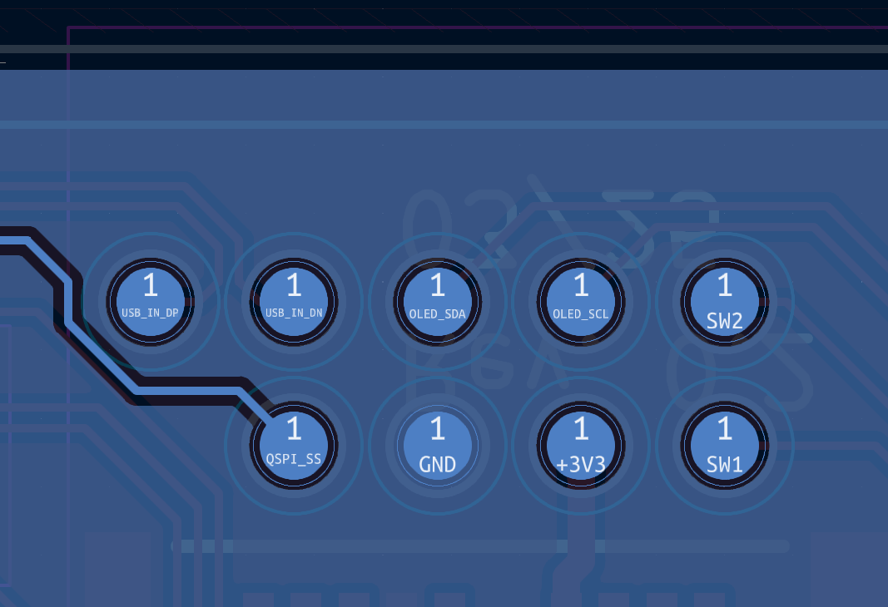
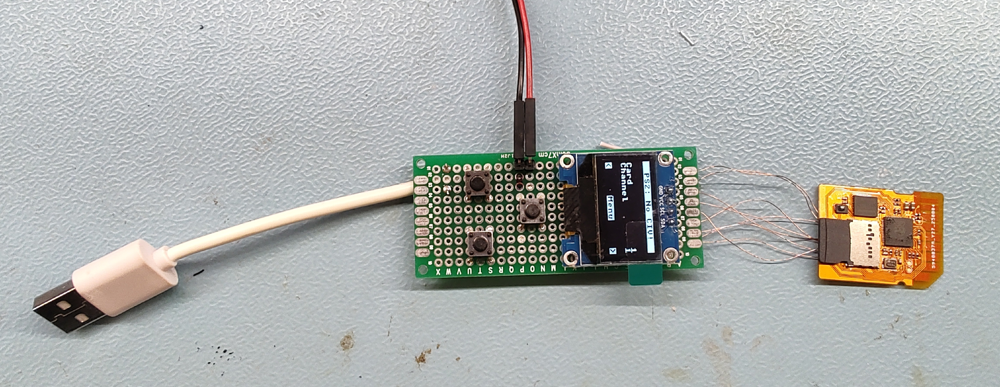
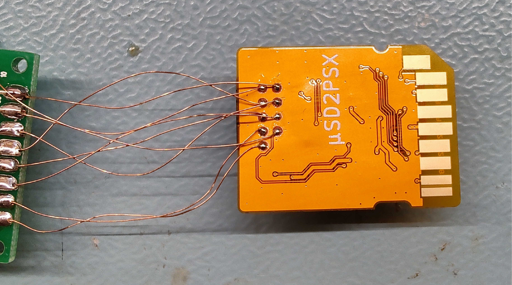
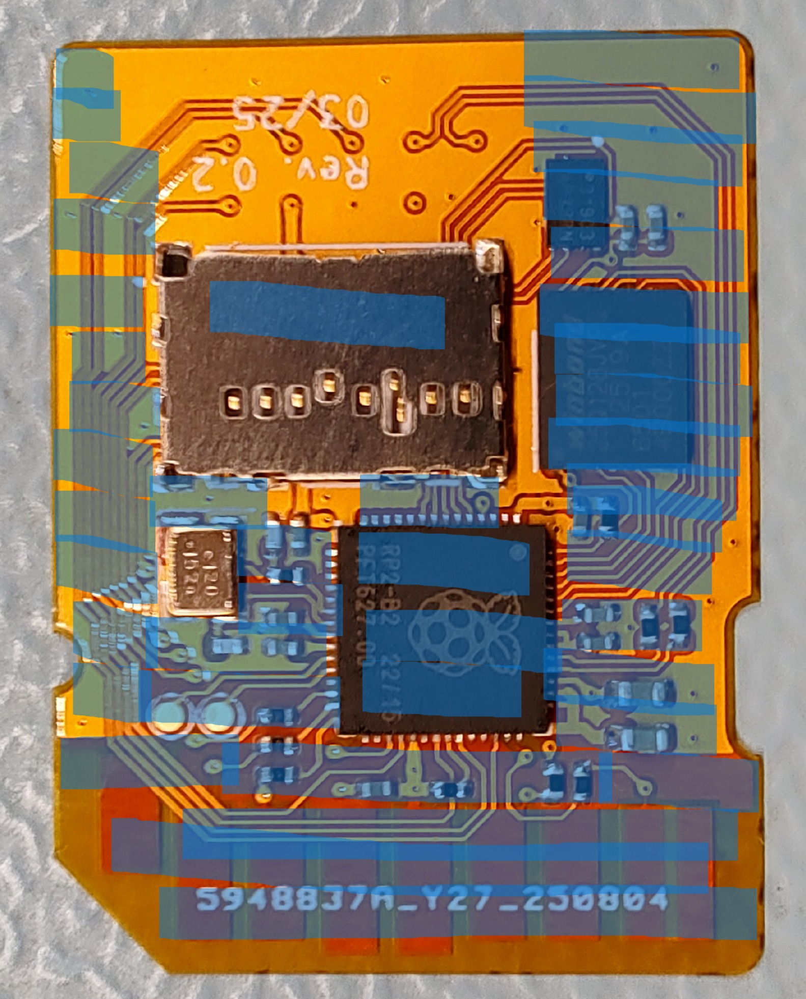
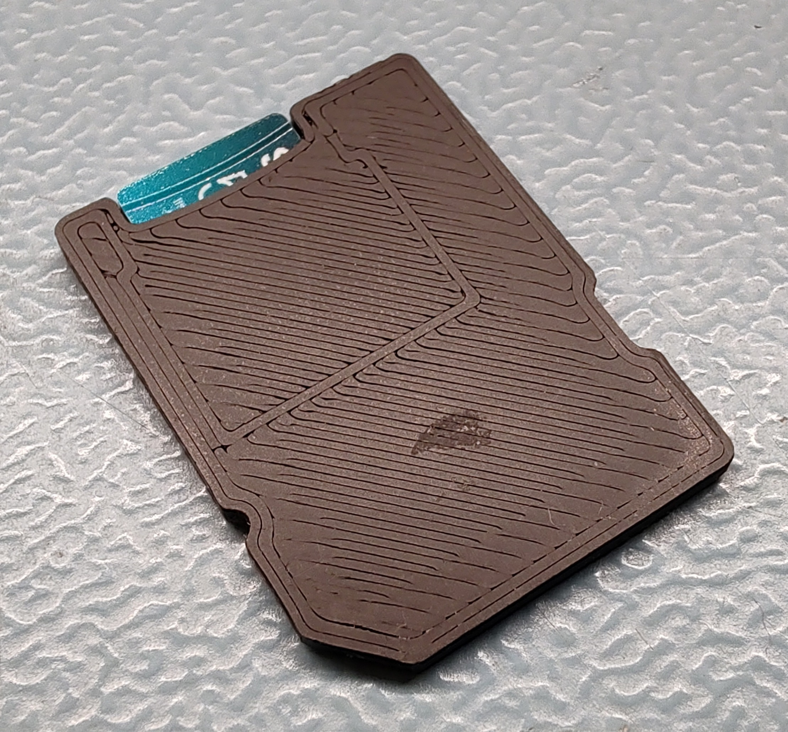
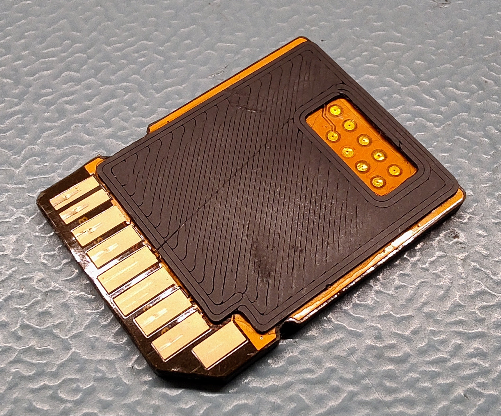
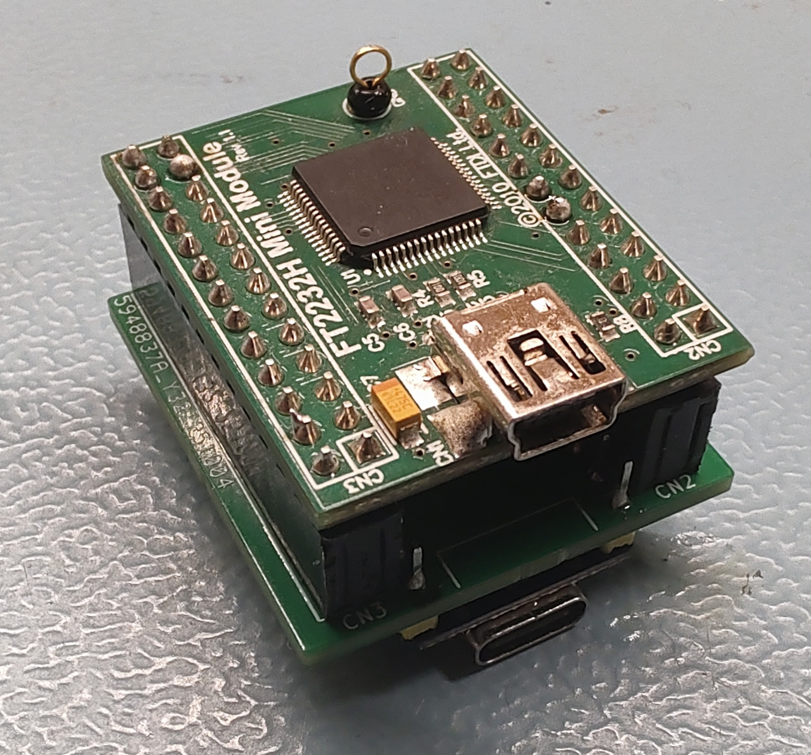
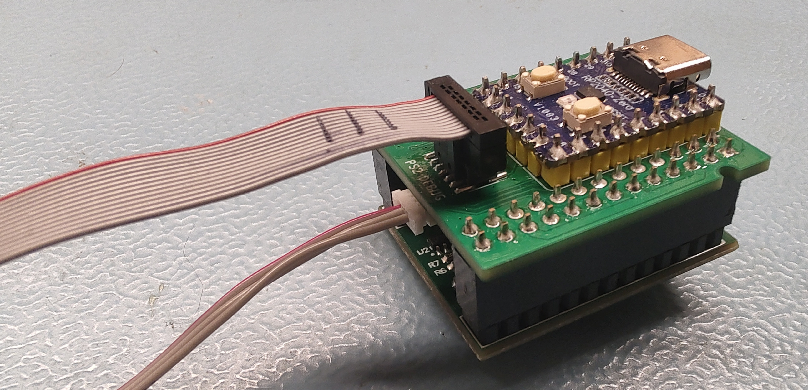
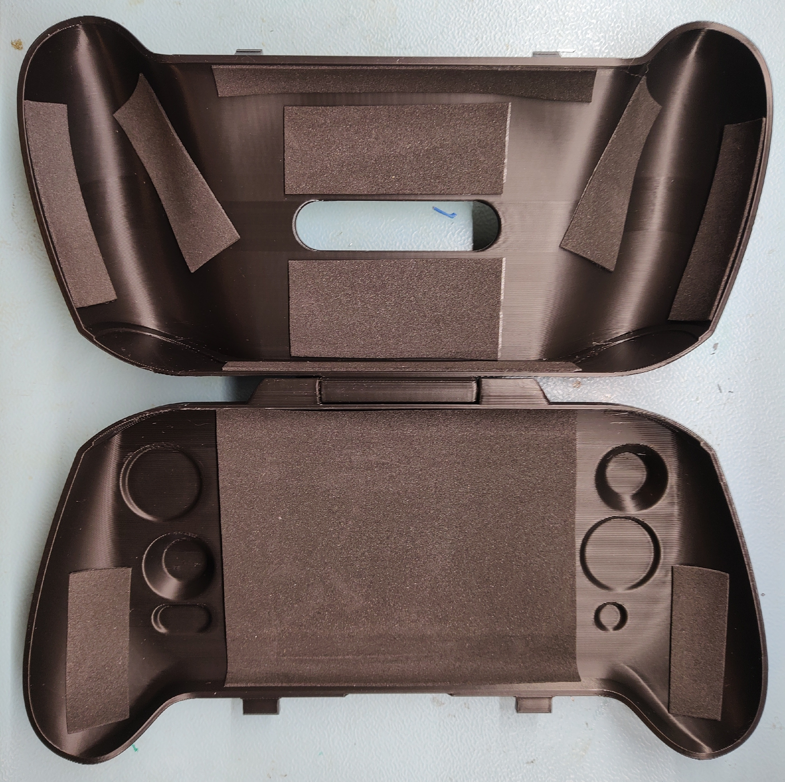
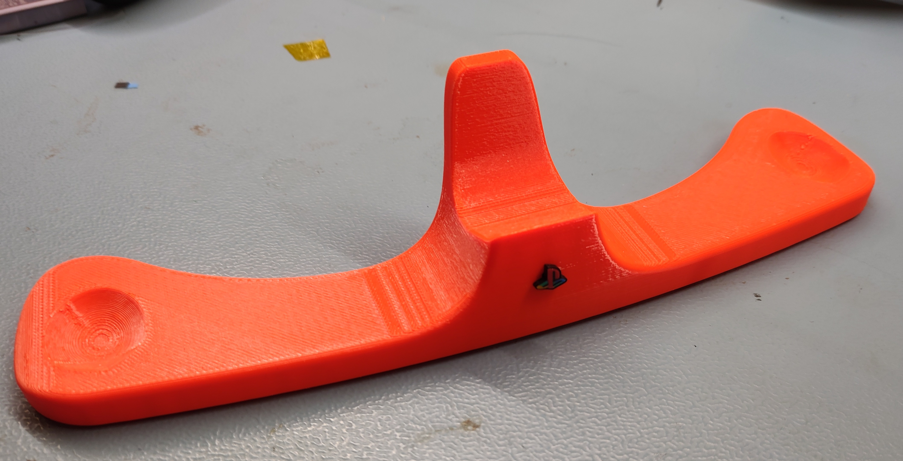

# Part 8: Accessories Assembly
This part of the assembly documentation will describe how to assemble the accessories of the PS2 portable.

## Recommended Tools:
- Soldering iron
- Side cutters
- Scalpel or similar
- Tweezers
- Tool for M1.6 heat set inserts
- Ruler
- Crimping tool IWS-0302BS
- Screw driver kit with at least a T5 bit

## Recommended Materials:
- Solder
- Kapton Tape
- 2 component epoxy

## uSD2PSX

### PCB Assembly
- Assemble the uSD2PSX Flex (REF4008) with the parts of its electrical BOM. 
    - Adhere the flex PCB to another rigid PCB using kapton tape, to make soldering easier

> For the flex PCB it is recommended to set your soldering iron temperature to ~250°C and to use leaded solder. The thin PEI dielectric can and will be damaged by high temperatures.

### Programming and Testing

This is the testpoint pinout:  

In order to flash the SD2PSXtd firmware, you will need to obtain the .uf2 file first. Find it [here](https://sd2psxtd.github.io).
For flashing you will need a 3.3V power supply to power the SD2PSX. Solder it to the +3V3 and GND test points. You will also need the BOOTSEL button (or alternatively short BOOTSEL to GND), solder it to QSPI_SS and GND.
Lastly you will need to sacrifice a USB A cable and solder D+, D- and GND of the cable to the testpoints USB_IN_DP, USB_IN_DN and GND. With these connections done, you can connect the USB cable to a PC, hold the BOOTSEL button and then enable 3.3V power. An explorer window should open and you can drag the SD2PSXtd firmware into it.

Now it is time to setup the uSD2PSX for loading games, the SD Card setup is identical to a normal SD2PSX. You will need to obtain CIV.bin and create a SD2PSX config file on the SD Card.
It's important to set Autoboot=ON and Mode=PS2 in the config file, the example config on the SD2PSXtd website already has this. In my case the firmware did not apply these setting initially, so there is a high chance that you will also need to connect the SD2PSX OLED display and two buttons (like on the SD2PSX) to the flex PCB. The OLED needs 3.3V, GND, SDA and SCL. You connect them to +3V3, GND, OLED_SDA and OLED_SCL. The two buttons are connected to SW1, SW2 and GND. 

Prepare the SD Card, insert it and power the uSD2PSX from 3.3V. Now you should be able to navigate the menu, enable PS2 mode and set Autoboot to ON if needed. When this is done you can desolder all wires from the testpoints and thoroughly clean the PCB, as flux residue might affect the adhesion of the epoxy we use later.

This setup is very much subobtimal, but fitting an SD2PSX onto a 2-layer SD Card sized flex PCB did not allow for connectors or a BOOTSEL button. Luckily this only needs to be done once (or if the firmware ever needs to be updated).
If you are planning to do this more than once, it might make sense to make something like this:  
      
      
    

### Assembly

The uSD2PSX consists of the flex PCBA, a *uSD2PSX Frame* (REF2017) and a *uSD2PSX Stiffener* (REF2018).

1. Apply 2K epoxy on the blue areas on the top side of the uSD2PSX flex PCB. Keep some distance around the openings of the micro SD Card slot and do not apply too much! 

    
2. Place the *uSD2PSX Frame* onto the uSD2PSX flex, align them and clamp the assembly somewhere during curing.
3. When cured, apply epoxy on the *uSD2PSX Stiffener* (correct side!) and place it on the bottom layer of the uSD2PSX flex.
4. Align them, so the part is flush with the upper edge and centered horizontally. Clamp the assembly for curing.
5. Once cured, cut off all excess epoxy using a scalpel.
6. Now you can insert the SD card again and test the uSD2PSX with the PS2 portable!
7. Lastly, place a piece of kapton tape over the exposed testpoints to provide at least a little ESD protection.

## Debugger
The debugger is optional and only required if you want to develop code for the SysCon or video processor.

What you need:
- [FT2232H Mini Module](https://ftdichip.com/products/ft2232h-mini-module/) for debugging the T20 FPGA
- RP2040 Zero programmed with the [debugger firmware](https://github.com/sentoxo/debugprobe_rp2040-zero)
- Debugger PCB (2 layer, 1.6mm), find it in the Electronics directory
- **FTSH-107-01-F-DV-K-P-TR** header and matching cable for the debugging FPGA and SysCon
- **SM03B-SRSS-TB** header and matching cable for programming the left and right gamepads

Solder all components to the Debugger PCB, preferrably using female pin headers (if you ever need to remove the RP2040 Zero or the FT2232H). That's about it for the debugger.

## Travel Case
The *Travel Case* is optional and less defined than the system itself.
There is space for about 1mm to 1.5mm of padding all around the portable, to keep it safe and free from scratches. What material to use and how to apply it is up to you, I personally use 1mm rubber foam sheets with pre-applied adhesive (REF1024).

You will need the following:

- ~1mm thick foam rubber sheets (REF1024), or some padding of your choice
- Two 25mm long M3 cylinder head screws (REF1025) for the hinge
- Top and bottom Travel Case housing (REF2020 and REF2021)
- Two Travel Case latches (REF2022 and REF2023)

Assembly:

1. Press the Travel Case latches (REF2022 and REF2023) into the top Travel Case part. They are marked left and right. Be careful when inserting to not crack the plastic or separate the layers. If they really don't fit, you may need to rework the parts using a scalpel.
2. Join top and bottom Travel Case housing parts using the 2 M3x25 cylinder head screws (REF1025)
3. Apply padding to the inside of the Travel Case. It's best to regularly check the fitment using the portable. If you go the foam rubber route, here is a reference on how I apply it:

Done!

## Display Stand
The *Display Stand* (REF2019) actually needs no assembly at all, if you want you can insert the PlayStation logo salvaged from the orgiginal PS2 slim shell in the front. There is a little protusion on the cylindrical part of the PS2 logo that you might need to remove for the logo to fit properly.

