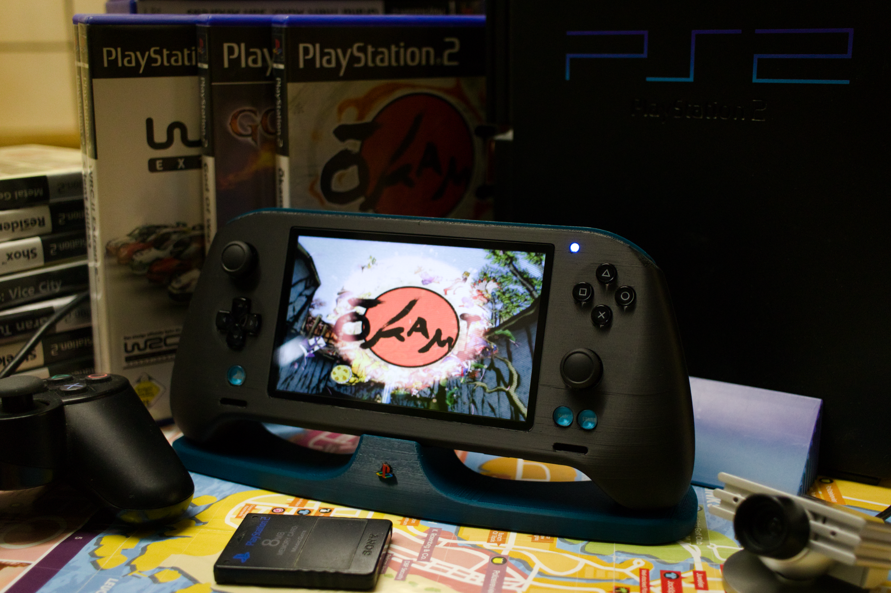
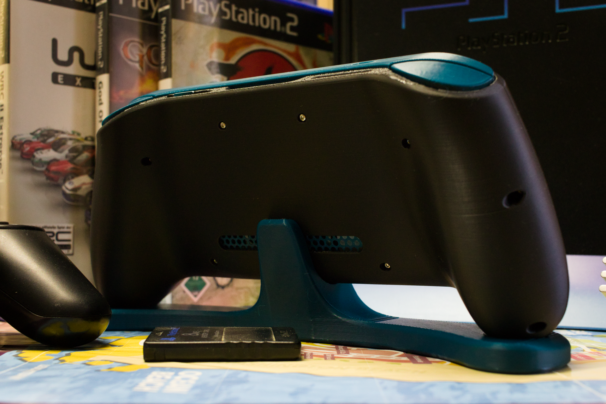
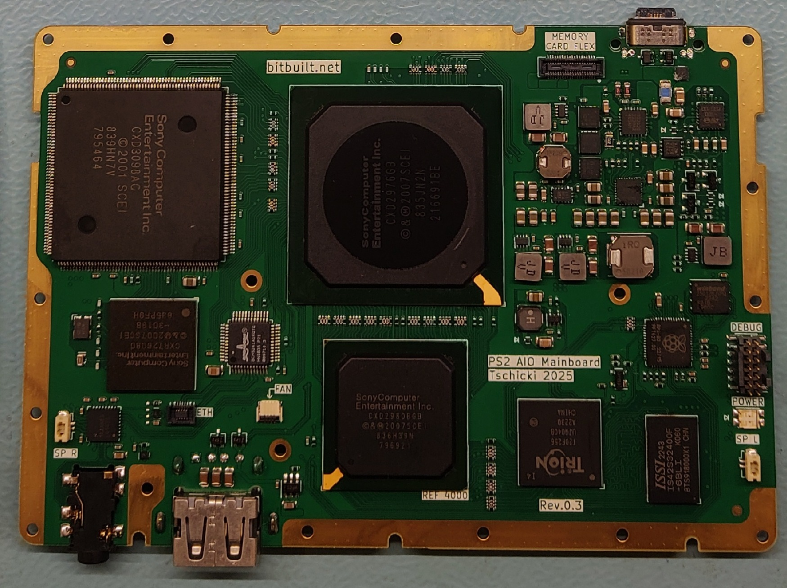
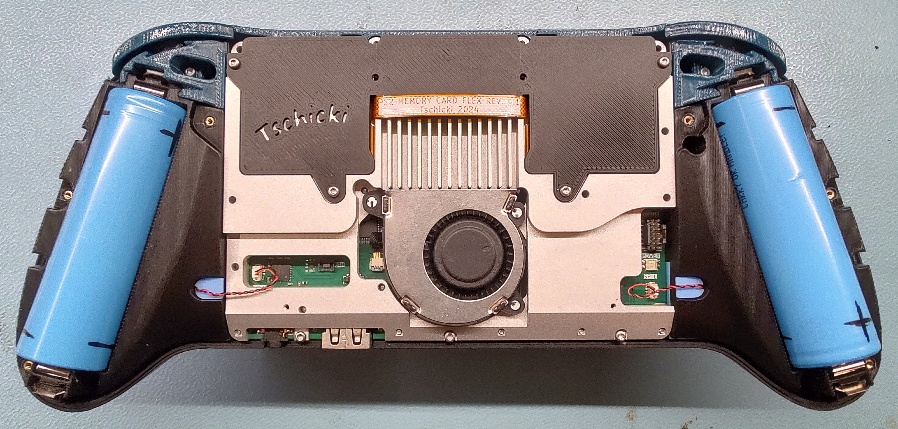

# A Custom PlayStation 2 Portable from Scratch

  

  

  

## About this Project
Just like the title says, this is a PlayStation 2 portable designed from scratch. This portable contains presumably world's first custom reverse engineered PS2 mainboard not made by Sony. It is only reusing 6 ICs of an original PS2, salvaged from SCPH-7900x or SCPH-9000x mainboards.

Most PS2 games can be played natively via OPL or NHDDL and the portable also features support for PS1 games via DKWDRV. Its two custom memory card slots are compatible with miniaturized PS2 Memory Cards, SD-Cards (MX4SIO) and a miniaturized SD2PSX.

Development of this project was started in 2022.

## Overview

### Custom PS2 AIO Mainboard
The mainboard was designed from scratch and is based on the SCPH-7900x and SCPH-9000x PS2 revisions. It also includes modern features, like USB-C PD charging and battery management, fully digital video output, I2S speaker and headphone amplifier and a customized boot ROM to boot directly into homebrew.  

#### Details:

- Battery Management:
    - USB C PD charging at 5V/9V/15V
    - Powered from 2S 5000mAh 21700 batteries for a total of 37Wh or about 4.5h of runtime on a single charge
    - Supports charge & play and includes a battery fuel gauge, protector and cell balancing

- Power Management:
    - Custom developed power management featuring modest EE and GS undervolting
    - Soft power button with minimal quiescent current
    - Monitoring to detect short circuits and overcurrent conditions

- Video Output:
    - Custom developed digital video processor based on a Trion T20 FPGA, written from scratch in VHDL
    - Fully digital direct drive of a 5” 480x800p DPI LCD by tapping right into the Graphics Synthesizer 24bit RGB output, replacing the stock PS2 video DAC
    - Features a motion-adaptive deinterlacer, line doubler, bilinear video scaler and OSD
    - Includes support for following resolutions:
        - 512i(256p) x 256, 512i(256p) x 320, 512i(256p) x 384, 512i(256p) x 448, 512i(256p) x 512, 512i(256p) x 640 at 50Hz
        - 448i(240p) x 256, 448i(240p) x 320, 448i(240p) x 384 at, 448i(240p) x 448, 448i(240p) x 512, 448i(240p) x 640 at 60Hz
        - VESA 480x640 at 60Hz

- Audio:
    - Custom I2S headphone and speaker amplifier using LM49450

- System Management:
    - Custom RP2040-based System Controller (SysCon) handling charging, discharging, power on/off, power management and monitoring
    - Custom developed DualShock 2 gamepad emulator running on core 1
        - Developed from scratch
        - Including rumble
        - Support for PS1 games
    - Custom developed configuration menu for changing and displaying various settings:
        - State of charge display (both in menu and via RGB LED)
        - EE temperature display and fan settings
        - Headphone and speaker volume
        - Various video processing settings, LCD brightness
        - Analog stick calibration and inversion
        - Deadzone settings
        - Power monitoring and TTE/TTF
        - And more…
    - SysCon firmware and video processor gateware updatable via drag & drop from USB-C

- Custom PS2 Boot ROM
    - Boots directly into PS2BBL, thanks to the BIOS modifications of Epaminondas – no softmods required

- Additional Features:
    - Fully functional PS2 RTC, enabled by an always-on standby rail

### Mechanical Assembly

The whole mechanical assembly was designed from scratch for FDM printing. The design goal was to make it as ergonomic as possible, while keeping the overall appearance simple and minimalistic.
The assembly is split into an outer shell and an inner assembly called 'skeleton' in an attempt to make assembly & disassembly easier and to allow easy shell replacements. Another priority for me was to use threaded inserts for all screws and to have easily replaceable non-soldered batteries.

  

#### Details:

- Gamepads
    - Custom designed & modular gamepad subassemblies that connect to the mainboard via I2C for best flexibility
    - PSVITA 2000 face buttons
    - 3.3V Nintendo Switch hall effect analog sticks
    - Rumble support: Coin-style rumble motors
    - Custom developed trigger mechanism using living hinges

- Cooling:
    - Custom designed aluminium heatsink covering the whole mainboard for maximum mechanical rigidity
    - Nintendo switch lite fan with configurable linear fan curve

- Interfaces:
    - Two fully accessible memory card slots, miniaturized by reusing SD card sockets
        - Natively compatible with MX4SIO, a custom reverse engineered PS2 memory card and a custom form factor SD2PSX 'uSD2PSX'
    - One USB A connector of the PS2, for using original accessories or USB sticks (DKWDRV)
    - Stereo headphone jack
    - USB-C connector for charging and SysCon firmware update

- Video and Audio
    - Stereo Nintendo Switch OLED speakers
    - 5" DPI LCD covered by a Nintendo 3DS XL glass screen lens

## Accessories
To further enhance the user experience, some more or less optional accessories were designed. 
- A *uSD2PSX* memory card in SD-Card format for running backups and saving games. Can also be unplugged to play on multiple consoles / portables, and is compatible for use on a stock console using a modified MX4SIO memory card. The best way to play games on the PS2 portable, and pretty much mandatory.
- A stand to place the portable while charging and when not in use.
- A travel case to protect the portable on-the-go.
- A reverse engineered PS2 memory card for saving games. Same form factor and interface as the uSD2PSX, but less useful. Don't bother with this and build the uSD2PSX instead.

## How to Build
I would highly recommend **not** to build one, even if you know what you are getting yourself into. If you're still not convinced to stop here, you can find the project documentation in the [documentation](https://github.com/tschicki/PS2-Portable/tree/main/Documentation) folder. It's best to read all the docs before you decide to continue.

You will need a lot of equipment and comprehensive electronics, soldering, troubleshooting and preferably also programming skills to have a chance of getting the custom PS2 mainboard to boot.

There is a [worklog](https://bitbuilt.net/forums/threads/some-ps2-project.5433/) of the whole project on BitBuilt, you might find some additional information there.

### Electronics
All custom PCBs, their Gerbers and their BOM can be found in the respective project under the [Electronics](https://github.com/tschicki/PS2-Portable/tree/main/Electronics) folder. All PCBs come from JLCPCB.

### Mechanics
All custom designed mechanical parts can be found under [Solidworks](https://github.com/tschicki/PS2-Portable/tree/main/Solidworks). If you would like to edit them, they were all designed using SolidWorks Maker. Otherwise, the STEP and STL exports can be found under [Output](https://github.com/tschicki/PS2-Portable/tree/main/Solidworks/Output).  
The housing parts were designed to be FDM printed, the CNC heatsink can be ordered from JLCCNC.

### Firmware & Gateware
The source files of the left & right gamepad firmware can be found [here](https://github.com/tschicki/PS2-Portable/tree/main/SysCon%20Firmware/PS2_Gamepad_02).  
The SysCon firmware can be found [here](https://github.com/tschicki/PS2-Portable/tree/main/SysCon%20Firmware/SysCon_FW).  
The Trion T20 gateware can be found [here](https://github.com/tschicki/PS2-Portable/tree/main/SysCon%20Firmware/SysCon_FW/ps2_video_processor).  

In order to obtain the required firmware, you need to compile it yourself. See the [documentation](https://github.com/tschicki/PS2-Portable/blob/main/Documentation/Part%2010_Development%20and%20Debugging.md) for that.

### Bill of Materials
The bill of materials for the mechanical assembly can be found [here](https://github.com/tschicki/PS2-Portable/blob/main/Documentation/Part%200_Mechanical%20BOM.md). The electrical BOM for each PCBA is in the [Electronics](https://github.com/tschicki/PS2-Portable/tree/main/Electronics) folder.

### Assembly Instructions
Check the [documentation](https://github.com/tschicki/PS2-Portable/tree/main/Documentation) folder. I tried to structure the sequence of documents so that it can guide you along for your build.

## Special Thanks
Thanks to the BitBuilt community for reading and commenting the worklog, it really helped to keep the motivation up! And special thanks to:
- Mister M and Gman for releasing their PS2 mainboard scans – without them this project would’ve taken much longer!
- Epaminondas for his amazing work on the custom PS2 BIOS. Seriously, you rock!
- Stuckpixel for helping out with converting the SPI part of the gamepad emulator to PIO. It’s much more reliable now!
- wisi and mixa232323 for guiding me in the right direction with all the boot ROM shenanigans
- StonedEdge and thedrew for their various suggestions and tips along the way
- All the awesome people working on the SD2PSX, neutrino and NHDDL! It's incredible to see how far the PS2 homebrew scene has come in the last couple of years!

## Known Bugs and Anomalies
This is a hobby project, so the end result will never be flawless. The design has seen hundreds of hours of playtesting, where following anomalies were discovered:
- The PS2 RTC drifts by about 7s a day, this could most likely be solved by selecting a different 32kHz crystal or by tweaking the load capacitors. However, the characteristics of the original crystal and the Mechacon's oscillator circuits are unknown.
- Games with static and permanently flickering elements can cause image retention on the LCD. I only noticed this on one game so far - Castlevania: Symphony of the Night, where certain HUD elements flicker. It is not recommended to play such games to prevent damage to the LCD.

## License
All firmware, gateware and hardware in this repository is licensed under the [MIT License](LICENSE).
